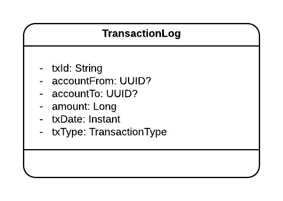
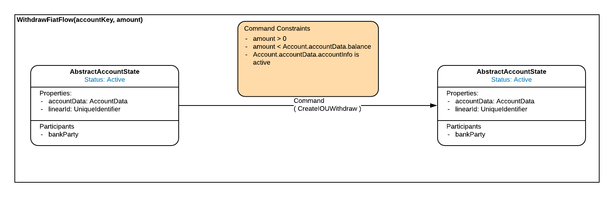
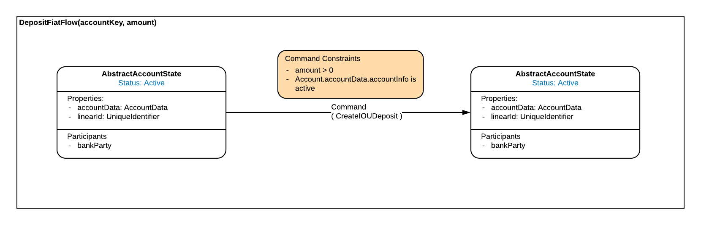

# Account deposits and withdrawals

## Introduction

### Rationale

Account deposits and withdrawals are the most basic and most common operations on accounts in any banking system.

Depending on the account type, some operations can be temporarily blocked based on account's status or some of the account's 
properties. In addition, some operations can be permanently blocked for certain account types. For example,
withdrawals from a loan account are not supported at any given time. 

This document describes the approach for implementing the related state transitions, and the associated flows for deposit 
and withdrawal operations

### Background

Based on the research done and based on [account requirements](../accounts/design.md#requirements), four types of accounts have 
been identified with three different statuses possible for each state:

* Current account.
* Overdraft account. 
* Savings account. 
* Loan account.

### Requirements

The requirements for a deposit to an account for each account type are:

 #### Current account

 A deposit to a current account will only be allowed for accounts in an ACTIVE state. The deposited amount is applied as credit to the account balance and the resulting balance will be the sum of the current balance and the deposited amount. If an overdraft has been approved on the account and the overdraft balance is greater than zero, the deposited amount will be used to credit the overdraft balance and any remaining credit will be applied to the account balance.
 
 #### Savings account

 A deposit to a savings account will only be allowed for accounts in an ACTIVE state. The deposited amount is applied as credit to the account balance and the resulting balance will be the sum of the current balance and the deposited amount.
 
 #### Loan account

 A deposit to a loan account will be only allowed for accounts in an ACTIVE state. The deposited amount is applied as credit to the debit account balance and the resulting balance will be the current balance subtracted by the deposited amount.


The requirements for a withdrawal from an account, for each account type are:
 
 #### Current account

 A withdrawal from a current account will only be allowed for accounts in an ACTIVE state, and the amount to be withdrawn must be less than the account balance. The withdrawal amount is subtracted from the account balance.

 If an overdraft has been approved on the account, the withdrawal amount must be less than the sum of the account balance and the approved overdraft limit, subtracted by the overdraft balance. In this case the withdrawal amount is subtracted from the account balance first, and the remainder is applied as a debit overdraft balance.
  
 #### Savings account

 A withdrawal from a savings account will only be allowed for accounts in an ACTIVE state. Additionally, the date of the withdrawal must be after the savings end date and the amount to be withdrawn must be less than the account balance. The withdrawal amount is subtracted from the account balance.
  
 #### Loan account

 The loan account does not support withdrawals.


## Design

### Data Model

Account states data model can be found at: 

[Account states data model](../accounts/design.md#data-model)

#### Transaction log

Every transactional operation needs to be recorded in an off-ledger table transaction_log which is then used in reporting
and for daily limit feature. TransactionLog entity is a Hibernate / JPA entity object which is persisted and retrieved from
DB via Corda's exposed restricted entity manager. 

The following is a summary of each property:
                                                  
 - `txId`        PK, unique ID of each transaction
 - `accountFrom` ID of the account from which amount is transferred, nullable field
 - `accountTo`   ID of the account to which amount is transferred, nullable field
 - `amount`      Amount being transferred from `accountFrom` to `accountTo` in the smallest denomination e.g. cents
 - `txDate`      The date of the transaction
 - `txType`      The type of the transaction which can be:
   - DEPOSIT
   - WITHDRAWAL
   - TRANSFER



### Interface/API Definitions

The following are the flows relating to account deposits and withdrawals:

#### Withdrawal

`WithdrawFiatFlow(accountId: UUID, amount: Amount<Currency>): SignedTransaction`

Withdraws specified amount from account with given `accountId`. The withdrawal operation will fail if:
 - given `accountId` is a reference to loan account or savings account in savings period.
 - specified account doesn't have sufficient funds on accounts balance. 
 - specified account has reached daily withdrawal limit. 
 - specified account is not in ACTIVE status. 
 
In all other cases, the operation will be successful and specified amount will be deducted from the account's balance. An entry will be
recorded in the transaction_log table.



#### Deposit

`DepositFiatFlow(accountId: UUID, amount: Amount<Currency>): SignedTransaction`

Deposits specified amount to account with given `accountId`. Operation will fail if specified account is not in ACTIVE status.
In all other cases, the operation will be successful and specified amount will be added to the account's balance. An entry will be recorded
in the transaction_log table.



### Business Logic

#### Withdrawal

After an account is fetched from the ledger, a flow calls the withdraw function on a `CreditAccount` object:

```kotlin
fun withdraw(amount: Amount<Currency>): CreditAccount
```

Implementation of the `withdraw` function is specific for each account type. For a savings account, the operation is allowed only when the account is ACTIVE, has sufficient funds, and is not within the savings period:

```kotlin
override fun withdraw(amount: Amount<Currency>): SavingsAccountState {
    verifyHasSufficientFunds(amount)
    verifyIsActive()
    verifyWithdrawalAllowed()
    return copy(accountData = accountData.copy(balance = accountData.balance - amount))
}
```

For current accounts, the operation is allowed only when the account is ACTIVE and has sufficient funds. The supports an overdraft facility, and the `approvedOverdraftLimit` and `overdraftBalance` fields are considered when verifying that sufficient funds are available.

```kotlin
override fun withdraw(amount: Amount<Currency>): CurrentAccountState {
    verifyHasSufficientFunds(amount)
    verifyIsActive()

    return if(accountData.balance >= amount) {
        val updatedAccountData = accountData.copy(
                balance = accountData.balance - amount,
                txDate = Instant.now())
        copy(accountData = updatedAccountData)
    } else {
        val updatedOverdraftBalance = (overdraftBalance ?: 0L) + amount.quantity - accountData.balance.quantity
        val updatedAccountData = accountData.copy(
                balance = 0 of accountData.balance.token,
                txDate = Instant.now())
        copy(overdraftBalance = updatedOverdraftBalance, accountData = updatedAccountData)
    }
}
```

If the `withdraw` function for a specific account type passes all the verification methods and returns account object 
with the amount deducted from the account's balance, this flow performs one last check to verify that daily withdrawal 
limit is not exceeded. This verification is same for all account types, and it is implemented as an extension function 
on AbstractAccountState object. It uses the transaction_log table to get the sum of all withdrawals for the account for 
a day and compares it with `withdrawalDailyLimit` if a limit has been set for the account in question.
Once the Corda transaction is signed, an appropriate entry is saved to the transaction_log table.

#### Deposit

After an account is fetched from the ledger, this flow calls the deposit function on the `Account` object:

```kotlin
fun deposit(amount: Amount<Currency>): Account
```

Implementation of the deposit function is similar for the savings and loan account types, the difference being that the savings account is crediting the amount to a credit balance (and should be summed) where as the loan account is crediting the amount to a debit balance (and should be subtracted). The following is the implementation of the `deposit` function for the savings account:

```kotlin
override fun deposit(amount: Amount<Currency>): SavingsAccountState {
    verifyIsActive()
    return CurrentAccountState(accountData.copy(balance = accountData.balance + amount, txDate = Instant.now()),
        withdrawalDailyLimit, transferDailyLimit, linearId)
}
```

The `deposit` function for the loan account also needs to check the balance on the account to ensure that the balance does not go into credit. The implementation is as follows:

```kotlin
override fun deposit(amount: Amount<Currency>): LoanAccountState {
    verifyHasSufficientFunds(amount)
    verifyIsActive()
    return copy(accountData = accountData.copy(balance = accountData.balance - amount))
}
```

As mentioned previously, the current account supports an overdraft balance and this should be credited prior to crediting any balance on the main account. There are three scenarios to consider:

 - The account is not overdrawn and the main balance is credited.
 - The overdraft balance is less than the deposit amount and the main balance is credited with the difference.
 - The overdraft balance is credited with the deposit amount.

This is implemented as follows:

```kotlin
override fun deposit(amount: Amount<Currency>): CurrentAccountState {
    verifyIsActive()

    return when {
        (overdraftBalance ?: 0L == 0L) -> {
            val updatedAccountData = accountData.copy(
                    balance = accountData.balance + amount,
                    txDate = Instant.now())
            copy(accountData = updatedAccountData)
        }
        ((overdraftBalance ?: 0L) < amount.quantity) -> {
            val updatedAccountData = accountData.copy(
                    balance = Amount((amount.quantity - (overdraftBalance ?: 0)), amount.token),
                    txDate = Instant.now())
            copy(overdraftBalance = 0L, accountData = updatedAccountData)
        }
        else -> {
            val updatedAccountData = accountData.copy(txDate = Instant.now())
            copy(overdraftBalance = (overdraftBalance ?: 0L) - amount.quantity, accountData = updatedAccountData)
        }
    }
}
```

Once the Corda transaction is signed, an appropriate entry is saved to the transaction_log table.

## Examples

For account creation examples please check [account creation examples](../accounts/design.md#examples)

Execute withdrawal from an account:
```kotlin
val amount = Amount(3000, Currency.getInstance("EUR")) // 30 euro
val signedTx = subFlow(WithdrawFiatFlow(accountId, amount))
```

Execute deposit to an account:
```kotlin
val amount = Amount(3000, Currency.getInstance("EUR")) // 30 euro
val signedTx = subFlow(DepositFiatFlow(accountId, amount))
```
