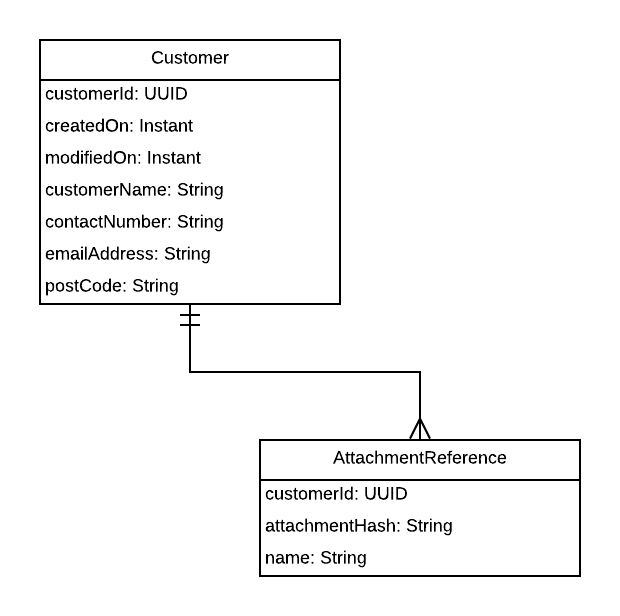
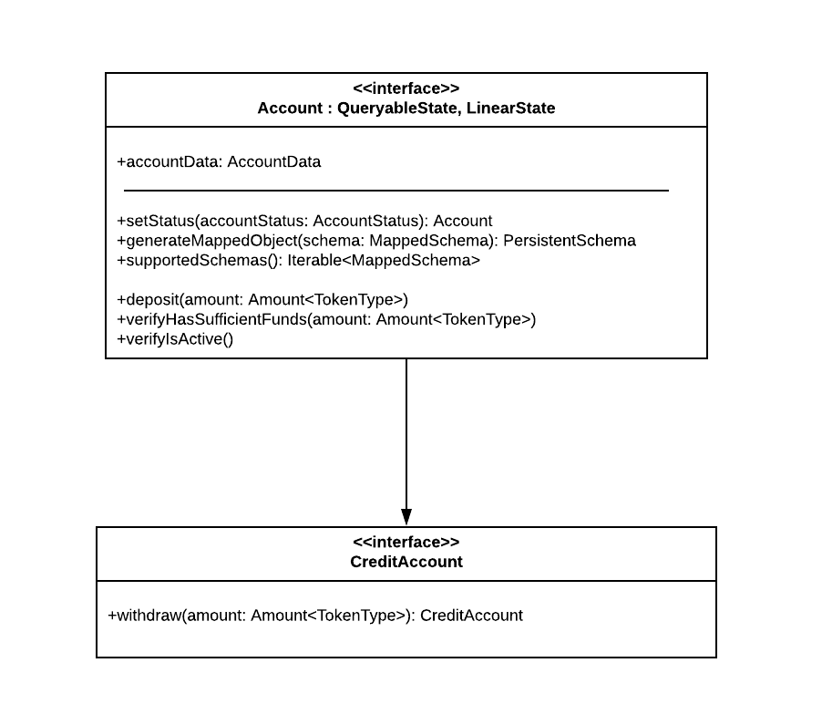
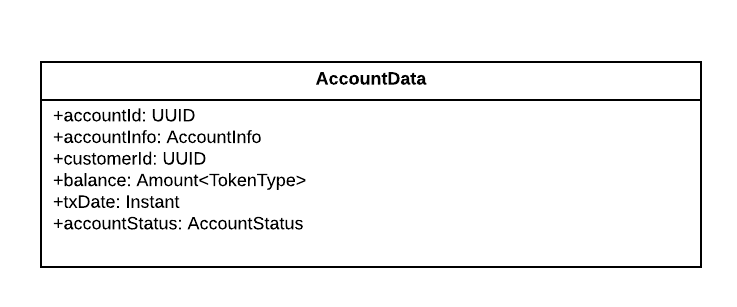
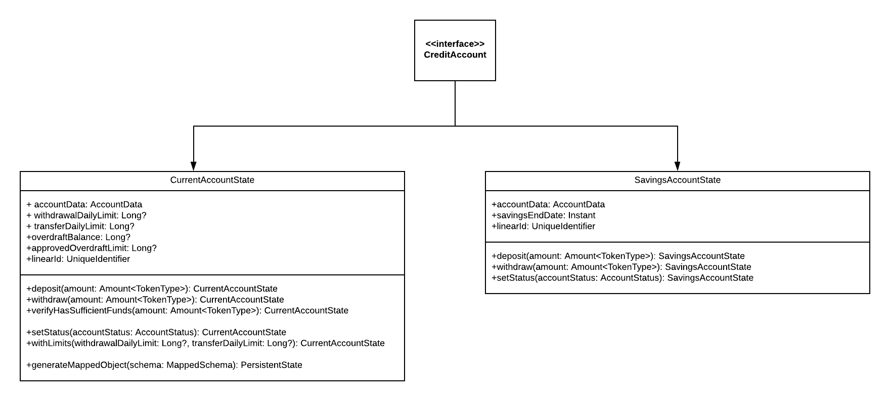
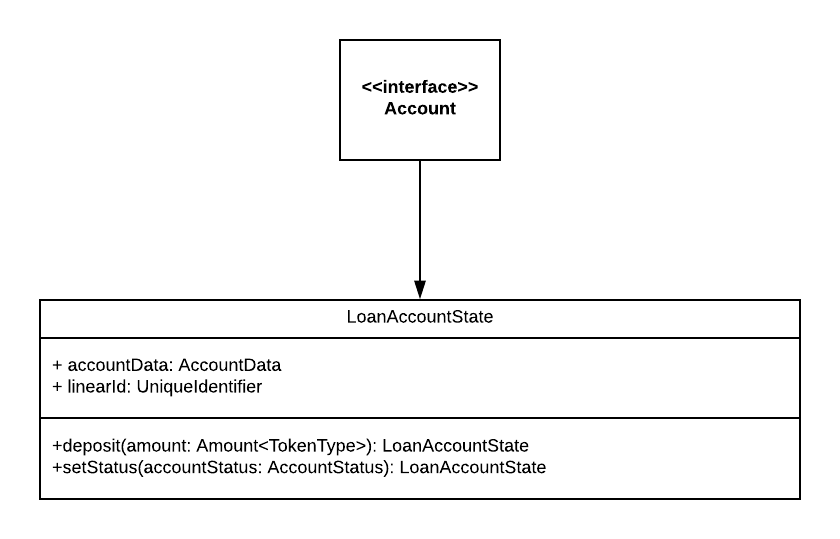

# Accounts

## Introduction

### Rationale

An account represents the financial standing between a customer and a financial institution, and forms the core of the Bank-in-a-Box CorDapp. All financial services, transactions, and reporting interact with an account in some way. It is important that these interactions can be processed coherently.

There are a number of considerations when implementing an account data model. There are several types of accounts, such as loan accounts, savings, or current accounts. Transactions will behave differently depending on the account type. For example, a savings account may restrict withdrawals depending on the savings agreement, whereas withdrawals from a loan account are not allowed at any time. Similarly, current accounts will behave differently depending on whether the balance is credit or debit.

While there are differences in how account types behave, there is a lot of commonality in the data model, which also needs to be considered to avoid duplication.

Financial institutions typically model account balances and transfers of value as IOUs. IOUs can easily be implemented in Corda and would preserve familiarity within the design and logic of the app. However, recent advances in digital currency has led to the development of new ways of modeling transfers of value, including `token-sdk` (https://github.com/corda/token-sdk), which has been designed specifically for use in CorDapps. Both approaches need to be considered and/or implemented.

This document describes the approach for implementing a financial account data model, the related states and the associated flows for account creation.

### Background

Prior to the design and implementation phases of this project, research was carried out to investigate existing account data models. Of the several models reviewed, the most complete and well documented was the `FinancialProduct` entity in the Microsoft Common Data Model (https://docs.microsoft.com/en-us/common-data-model/). This entity models all banking product types as a single data model. There is no separation by account type and includes fields for multiple loan account types, overdraft accounts, joint accounts etc.

The Corda accounts library (https://github.com/corda/accounts) allows Corda to partition its collection of state objects into a number of subsets, where each subset represents a Corda account. Corda accounts can be created by host nodes and nodes can create Corda accounts for a range of purposes such as customer accounts, balance sheets or P&L accounts, employee accounts, or in this case, a banking account.

Financial accounts require supporting documentation to be attached to the application, and this documentation should be recorded permanently for further reference. Corda attachments are ZIP/JAR files referenced by hash but not included in the transaction, and typically contain contract code, metadata about a transaction e.g. an invoice being settled, or shared information to be permanently recorded on the ledger (see: https://docs.corda.net/docs/corda-os/4.5/tutorial-attachments.html).

Object serialization is the process of converting objects into a stream of bytes. Serialization occurs every time an object is sent between a node and an RPC client, when a transaction is stored in the database, or when a flow is check-pointed. Corda uses an extended form of AMQP for serialization in peer-to-peer networking and persisted messages, and Kryo for the check-pointing of flows (see https://docs.corda.net/docs/corda-os/4.5/serialization.html).

### Requirements

A customer can have one or more accounts, and the Bank-in-a-Box CorDapp should support the following account types:

 - Current account
 - Overdraft account
 - Savings account
 - Loan account

Prior to account creation, a customer is required to register their personal and contact details, and supply relevant supporting documentation as attachments.

Accounts should be created with status pending and are set to active following manual review. The activity on an account can be frozen i.e. the account cannot enter into any contract, by setting its status to suspended and can be unfrozen, or reactivated, by updating its status.

Accounts are required to support a daily withdrawal and transfer limit, where a withdrawal or transfer transaction will not be processed if this limit has been exceeded. These limits are set on account creation and can be updated on agreement.

### Non-Goals

 - Balances will be implemented using IOUs but flows will be designed to allow for a token balance implementation later
 - A customer's name and post code cannot be updated, as this would require legal documentation and a process of review

## Design

### Data Model

#### Customer schema

A customer can have one or more accounts and each account should store a reference to the owning customer's details. These details are stored off ledger in the `Customer` schema.



The `Customer` schema stores personal details and contact information along with creation and modification timestamps. A customer can have one or more associated Corda attachments, which can be used to store supporting documentation, and the hash references to these attachments are stored in the `AttachmentReference` schema along with a descriptive name.

#### Abstract data model

Account behaviour differs by account type but the data model is largely the same. The main behavioural differences can be explained by the split between credit and debit account types, and this forms the core of the abstract data model. The core data model is described by a general `Account` interface and this is extended by the `CreditAccount` interface.



The `Account` interface extends the `LinearState`, which represents a state that evolves over time i.e. an account, and the `QueryableState` interface, which allows for state persistence. These state interfaces require the `linearId` property, and the `generateMappedObject` and `supportedSchemas` methods.

The general `Account` interface implements features common to all accounts types, such as:

 - `deposit`: apply credit to the balance on the account (credit and debit accounts will behave differently)
 - `setStatus`: update the status on the account
 - `verifyIsActive`: check that the account is in an active state
 - `verifyHasSufficientFunds`: verify there is sufficient funds on the account prior to balance updates

The `CreditAccount` interface adds functionality for withdrawals, which are not a feature of debit accounts and as such, are excluded from the general account type.

The main motivation for extending `Account` into `CreditAccount` is for typing rather than for data model or functional differences. APIs can be designed to accept either `CreditAccount` or `Account`, or specific implementing class states. For example, the from account in a transfer should only allow a `CreditAccount` type but the to account should support all account types.

General account information is stored in the `AccountData` class. This simplifies inheritance and any updates or amendments can be applied to this single class.



The following is a summary of each property:

 - `accountId` convenient reference to the Corda account id as a `UUID`
 - `accountInfo` is a reference to the Corda account object
 - `customerId` id of customer
 - `balance` the current balance of the account
 - `txDate` timestamp of the last transaction
 - `accountStatus` status of account (`SUSPENDED`, `PENDING` or `ACTIVE`)

The balance is implemented as `Amount<Currency>` to represent IOU balances e.g. `Amount<GBP>`.

#### Account states

There are two implementing credit account states: `CurrentAccountState`, `SavingsAccountState`, and one direct implementation of the account state: `LoanAccountState`. The following is a class diagram of the credit account states:



The `SavingsAccountState` supports typical credit account features but does not allow withdrawals during the savings period. The `savingsEndDate` property stores the end date of the associated savings plan payments and withdrawals are not allowed before this date.

The `CurrentAccountState` adds support for an overdraft facility with the properties `overdraftBalance` and `approvedOverdraftLimit`, and daily withdrawal and transfer limits, with the `withdrawalDailyLimit` and `transferDailyLimit` properties. The `generateMappedObject` method is overridden to add these properties to the persisted state, allowing these data to be queried.

Here is a class diagram of the `LoanAccountState`, a debit account that implements the `Account` interface directly:



The `LoanAccountState` models its balance as a debit balance and deposits are applied by adding credit to the debit balance, in other words, the deposit amount is subtracted from the balance on the account. This state uses the `verifyHasSufficientFunds` method to verify the deposit amount is not greater than the balance on the account, as the account should never be in credit.

### Interface/API Definitions

The following are the flows relating to account state creation and non balance updates.

#### Customer

`CreateCustomerFlow(customerName: String, contactNumber: String, emailAddress: String, postCode: String, attachments: List<Pair<SecureHash, String>>): UUID`

Create a new customer with personal details and contact information, and return the id. `attachments` is a list of `SecureHash`, `String` pairs with references to the Corda attachments of supporting documentation.

`UpdateCustomerFlow(customerId: UUID, attachments: List<Pair<SecureHash, String>>)`

Update the customer with `customerId` with a list of new attachments to append. `attachments` is a list of `SecureHash`, `String` pairs with references to the Corda attachments of additional customer documentation.

#### Account creation

`CreateCurrentAccountFlow(customerId: UUID, tokenType: Currency, withdrawalDailyLimit: Long?, transferDailyLimit: Long?): SignedTransaction`

Create a zero balance current account for customer with id `customerId`, optionally specifying a withdrawal and/or transfer daily limit.

`CreateSavingsAccountFlow(customerId: UUID, tokenType: Currency): SignedTransaction`

Create a zero balance savings account for customer with id `customerId`.

`IssueLoanFlow(accountId: UUID, loan: Amount<Currency>, periodInMonths: Long): SignedTransaction`

Issue a new loan to a customer with the repayment account referenced by `accountId`. The loan amount is deposited into the repayment account given by `accountId`, and a new loan account is created. A recurring payment is created from the repayment account to the loan account, and the repayment amount is calculated such that, the loan amount is repaid over the loan term `periodInMonths`. The repayment account must be a current account.

#### Account Updates

`ApproveOverdraftFlow(accountId: UUID, amount: Long): SignedTransaction`

Approves an overdraft limit for account with id `accountId`. Allows account to be overdrawn by `amount` currency units where currency is the currency of the account balance and a unit is the base unit of the currency e.g. cent for `EUR` and pence for `GBP`.

`SetAccountLimitsFlow(accountId: UUID, withdrawalDailyLimit: Long?, transferDailyLimit: Long?): SignedTransaction`

Set new daily withdrawal or transfer limits for account with id `accountId`.

`SetAccountStatusFlow(accountId: UUID, accountStatus: AccountStatus): SignedTransaction`

Update the status of the account with id `accountId`. This flow can be used to manually approve a pending account by setting the status to `ACTIVE`, or it can be used to suspend or reactivate an account, by setting the status to `SUSPENDED` or `ACTIVE`, respectively.

### Business Logic

#### Account Status

The status of an account can be `PENDING`, when an account is first created and is awaiting approval, `ACTIVE` or `SUSPENDED`, where all account activity is frozen. There is a limit to status transitions, for example, an account that has been approved can never be set to status pending. An extension function has been implemented to verify the status transitions.

```kotlin
fun AccountStatus.canProgressToStatus(accountStatus: AccountStatus) = 
    when(this) {
        AccountStatus.SUSPENDED -> accountStatus == AccountStatus.ACTIVE
        AccountStatus.PENDING -> accountStatus == AccountStatus.ACTIVE || accountStatus == AccountStatus.SUSPENDED
        AccountStatus.ACTIVE -> accountStatus == AccountStatus.SUSPENDED
    }
```

#### Extending the mapped schema

The `generateMappedObject` method returns a representation of the given schema, and for the `Account` interface it is implemented as follows:

```kotlin
override fun generateMappedObject(schema: MappedSchema): PersistentState {
    return when (schema) {
        is AccountStateSchemaV1 -> AccountStateSchemaV1.PersistentBalance(
                this.accountData.accountInfo.identifier.id,
                this.accountData.balance.quantity,
                this.accountData.txDate,
                this.accountData.status,
                this.accountData.customerId,
                this.linearId.id)
        else -> throw IllegalArgumentException("Unrecognised schema $schema")
    }
}
```

The `CurrentAccountState` adds the additional properties `withdrawalDailyLimit`, `transferDailyLimit`, `approvedOverdraftLimit` and `overdraftBalance`, and the above method needs to be overridden in order for these properties to be accessible within the schema.

The following shows how these properties can be added to the above mapped object:

```kotlin
override fun generateMappedObject(schema: MappedSchema): PersistentState {
    val persistentState = super.generateMappedObject(schema)
    if (persistentState !is AccountStateSchemaV1.PersistentBalance) {
        throw IllegalArgumentException("Schema $schema is not a AccountStateSchemaV1.PersistentBalance schema type")
    }
    
    persistentState.withdrawalDailyLimit = withdrawalDailyLimit
    persistentState.transferDailyLimit = transferDailyLimit
    persistentState.overdraftBalance = overdraftBalance ?: 0
    persistentState.overdraftLimit = approvedOverdraftLimit ?: 0

    return persistentState
}
```

#### Implementing the withdraw method with overdraft support

The `CurrentAccountState` extends the `CreditAccount` to support overdrawn balances up to an approved limit, and is facilitated with the properties, `overdraftBalance` and `approvedOverdraftLimit`. The `overdraftBalance` property tracks the debit amount on the account and the `approvedOverdraftLimit` sets the maximum debited amount allowed. The withdraw method can be adapted as follows to allow overdraft withdrawals:

```kotlin
override fun withdraw(amount: Amount<TokenType>): CurrentAccountState {
    verifyHasSufficientFunds()
    verifyIsActive()
    
    return if(accountData.balance >= amount) {
        val updatedAccountData = accountData.copy(
                balance = accountData.balance - amount,
                txDate = Instant.now())
            copy(accountData = updatedAccountData)
        } else {
            val updatedOverdraftBalance = (overdraftBalance ?: 0L) + amount.quantity - accountData.balance.quantity
            val updatedAccountData = accountData.copy(
                    balance = 0 of accountData.balance.token,
                    txDate = Instant.now())
            copy(overdraftBalance = updatedOverdraftBalance, accountData = updatedAccountData)
        }
}
```

Firstly, the method checks that the account has sufficient funds, in either the account balance or the `approvedOverdraftLimit`, and also that the account is active. If there are sufficient funds on the account balance, the account is debited as normal. Otherwise, `balance` is set to zero and `overdraftBalance` is set to the withdrawal amount with the available account balance deducted.

#### Custom Serialization

Corda uses the Kryo serializer to serialize objects on the call stack when suspending flows. There are known issues serializing JPA entity objects, particularly if they use one to many relationships or other complex structures. One approach to overcome this, is to map entity objects to data classes, referred to as data transfer objects (DTOs), for use within flows. Another approach is to implement custom serializers that generate the serialization for Kryo.

A custom serializer for a JPA entity can be specified with the `DefaultSerializer` annotation:

```kotlin
@Entity
@Table(name = "customer")
@DefaultSerializer(CustomerSchemaSerializer::class)
@CordaSerializable
class Customer (
)
```

A custom serializer should extend the Kryo `Serializer` abstract class, and implement the `read` and `write` methods. The following is a modified example of the `CustomerSchemaSerializer` class:

```kotlin
class CustomerSchemaSerializer : Serializer<CustomerSchemaV1.Customer>() {
    override fun write(kryo: Kryo, output: Output, `object`: CustomerSchemaV1.Customer) {
        output.writeString(`object`.createdOn.toString())
    }

    override fun read(
        kryo: Kryo,
        input: Input,
        type: Class<CustomerSchemaV1.Customer>?
    ): CustomerSchemaV1.Customer? {

        val createdOn = Instant.parse(input.readString())
        return CustomerSchemaV1.Customer(
            createdOn = createdOn,
            modifiedOn = Instant.now(),
            customerName = "",
            contactNumber = "",
            emailAddress = "",
            postCode = "",
            attachments = listOf())
    }
```

The above shows the serialization of the `createdOn` property in the `Customer` schema class. The `write` method tells Kryo explicitly how to serialize the object of type `CustomerSchemaV1.Customer`, and in this case, it simply converts the `createdOn` property into a string and writes it to the output. Similarly, the `read` method tells Kryo how to deserialize the stored properties and recreate an instance of `CustomerSchemaV1.Customer`. The `createdOn` property value is set by reading a single string from the input and uses the `Instant.parse` method to parse the string into an `Instant` type. An instance of the `Customer` schema class is created using the deserialized `createdOn` value (and in this example using empty values for the other properties that were not serialized) and is returned.

## Examples

Create a new customer account:
```kotlin
val supportingDocumentationPath = File("/path/to/supportDocumentation.zip")

val attachment = serviceHub.attachments.importAttachment(
        supportingDocumentationPath.inputStream(),
        ourIdentity.toString(),
        supportingDocumentationPath.name)

val attachments = listOf(Pair(attachment, "Supporting documentation"))

val customerId = subFlow(
    CreateCustomerFlow(
        customerName = "AN Other", 
        contactNumber = "5551234", 
        emailAddress = "another@r3.com", 
        postCode = "ZIP 1234", 
        attachments = attachments))
```

Create a new current account:
```kotlin
val signedTx = subFlow(
    CreateCurrentAccount(
        customerId = customerId, 
        tokenType = Currency.getInstance("EUR"),
        withdrawalDailyLimit = 500,
        transferDailyLimit = 1000))

val accountId = signedTx.tx.outputsOfType<CurrentAccountState>().single().accountId
```

Set account to active:
```kotlin
subFlow(SetAccountStatusFlow(accountId, AccountStatus.ACTIVE))
```

Approve overdraft:
```kotlin
val amount = Amount(10000, Currency.getInstance("EUR")) // 100 euro
subFlow(ApproveOverdraftFlow(accountId, amount))
```
