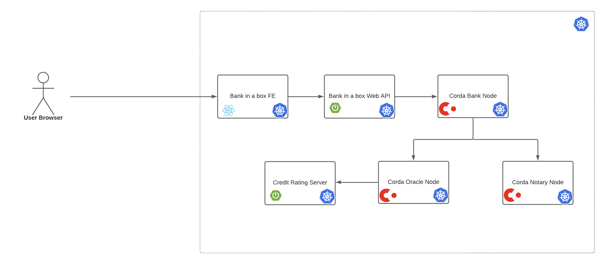

# Deployment

## Introduction

### Rationale

Corda supports and enables various deployment strategies based on several factors including the actual environment where 
the Corda network (prod, pre-prod, UAT, testing, dev) is deployed, cluster size, etc.
  
While some approaches and tools are designed for full production deployment and therefore require a significant
 number of configuration steps such as keystore generation, network parameter signing, etc., simpler approaches like 
 Gradle `deployNodes` tasks are more suitable for quick development - deployment cycles.

This document describes the "production-like" approach of the Bank in a Box reference application deployment where some
 configuration steps have been pre-configured to allow users quick and easy deployment with some standard cloud and
 containerization technologies.
  
### Background

The following tools are used in the Bank in a Box deployment.

[Docker](https://www.docker.com) has become the preferred software packaging and containerization tool, adopted and
 supported by all major cloud providers. There are many benefits to software containerization including portability, 
 environment consistency, and isolation of resources. 
 
[Kubernetes](https://kubernetes.io) is an open source container orchestration engine widely adopted among cloud
 providers. Containerized applications can benefit from a rich set of Kubernetes features such as additional security,  
 isolation, autoscaling, and automated deployment.
 
[Helm](https://helm.sh/) is a package manager for Kubernetes resources. Helm enables easy management, versioning,  
 templating, and deployment of Kubernetes resources. 
 

### Who is this deployment guide for? 

This deployment guide is intended for use by either of the following types of Bank in a box users:

* Any user with a moderate understanding of Kubernetes who wants to create a Bank in a box reference application using
 default configurations.
* Software developers who wish to run a Bank in a box reference application in their development environment.

### Prerequisites

The reference deployment for Corda Bank in a box runs on Kubernetes which can be hosted locally or in a cloud
 provider environment. This deployment guide assumes that a basic Kubernetes cluster is configured. The Kubernetes
 cluster must have access to a private Docker repository to obtain Bank in a box Docker images.

Your local machine operating system should be a Linux, Mac OS, or a Unix-compatible environment for Windows (for example, 
Cygwin) as the deployment uses Bash scripts. The deployment process is driven from your local machine using third-party 
tools: Docker, Kubectl, and Helm. The Deploy your network section provides links to official installation guides of
 the required tools.
 
### Compatibility

The deployed network runs on Kubernetes minimum version 1.16.9 and Helm minimum version 3.1.1.


## Deployment

### Deployment overview

The provided deployment runs all Bank in a Box services inside a single, dedicated Kubernetes namespace (default
 name:default). Each service runs in its own dedicated Kubernetes pod:
 
 * `bank` (Corda node with Bank in a box CorDapp)
 * `oracle` (Corda node with Bank in a box CorDapp)
 * `notary` (Corda notary node)
 * `credit-rating-server` (Spring Boot dummy credit rating server)
 * `web-api-server` (Bank in a box Web API exposed via Spring Boot)
 * `bank-in-a-box` FE (Bank in a box Front end React Application)
 
 
 
The Bank in a box Corda network is bootstrapped with PKI certificates, and sample X.500 subject names are provided as
 defaults (for example, the Bank certificate subject is “O=Bank,L=London,C=GB”).

### Deploy your network

The deployment steps are given below:

#### 1. Install tools on your local machine

1. Install [Docker Desktop for Windows](https://docs.docker.com/docker-for-windows/install/) or [Docker Desktop for
 Mac](https://docs.docker.com/docker-for-mac/install/). If deployment is run in a cloud provider's Kubernetes cluster,
 this step is not required. This step is only required if deployment is run in a local Kubernetes cluster. If
 step 1 is performed, steps 2 and 3 can be skipped since Docker Desktop will install both kubectl and Docker.

2. Install [kubectl](https://kubernetes.io/docs/tasks/tools/install-kubectl/).

3. Install [Docker](https://www.docker.com/get-started).

4. Install [helm](https://helm.sh/docs/intro/install/). Ensure that the value in the version field for ```helm
 version``` is 3.2 or higher, as shown in the example below:
 
 ```
 version.BuildInfo{Version:"v3.3.4", GitCommit:"a61ce5633af99708171414353ed49547cf05013d", GitTreeState:"dirty", GoVersion:"go1.15.2"}
```

#### 2. Download Bank in a box deployment scripts

You can find the files required for the following steps in the [Bank in a box repo](https://github.com/corda/refapp/tree/master).

#### 3. Database setup

Bank in a box services are pre-configured to use embedded H2 databases by default. No further setup is needed if an H2 
database is sufficient for your needs.

You may wish to use an external database configuration if you want to check database changes while you are running the 
application. In this case you will need to install a database(s), set up users and permissions, and change database 
configuration options for Bank in a box services before starting those services. See the sample PostgreSQL installation 
guide and explanation of Bank in a box external database support configuration options below for instructions.
 
#### External database support
You can configure the services to use an external database. A database can be installed as a pod inside the same 
Kubernetes cluster or as a separate installation outside the Kubernetes cluster. The example below shows a PostgresSQL 
installation that runs inside the same Kubernetes cluster where Bank in a box runs.

A PostgreSQL database can be installed inside the Kubernetes cluster using a third-party Bitanmi Helm chart:

```
20DUB-MAC07:helm user$ helm repo add bitnami https://charts.bitnami.com/bitnami
helm install bank-in-a-box-database bitnami/postgresql
```

Follow the instructions displayed by the script output to connect to the database server via psql. You can create a 
separate database server for each Bank in a box service by running the Helm script multiple times with different names
and then setting up the database user/schema, following the instructions in the CENM database setup section. 
Alternatively, you can create several databases inside the single PostgresSQL server you have just deployed, by running 
the following DDL commands:

```
CREATE DATABASE <DATABASE>;
CREATE USER <USER> WITH PASSWORD '<PASSWORD>';
GRANT ALL PRIVILEGES ON DATABASE <USER> to <DATABASE>;
```
For each service (Bank, Web API server), use different `<DATABASE>` name and `<USER>` - for example, `bankdb` / `bankuser`
 for the Bank node.

The database used by each service is configured via JDBC URL and is defined in the `values-<service-name>.yml` file for
the Helm chart of the respective service - for example, `helm/bank-in-a-box/values-bank.yaml` for the Bank node. In the 
`values-bank.yaml.yml` file, edit the database section of the configuration to change the JDBC URL, user, and password.

The deployed service already contains JDBC drivers for PostgreSQL. For other RDBMS's, you need to extend
the Docker images for the service by adding the database JDBC driver `.jar` file to the `/opt/corda/drivers/` directory.

Example settings for connection to a PostgreSQL database follow below:

```
dataSource:
 className: "org.postgresql.Driver"
 url: "jdbc:postgresql://<HOST>:<PORT>/<DATABASE>"
 user: "<USER>"
 password: "<PASSWORD>"
```

In this example, `<HOST>` is a placeholder for the host name of the server, `<PORT>` is a placeholder for the port number 
the server is listening on (typically 5432 for PostgreSQL), `<DATABASE>` is a placeholder for the database name, and 
`<USER>` and `<PASSWORD>` are placeholders for the access credentials of the database user.
 
#### 4. Docker Images

**Option 1** Build your images from source code

To build your images from source code `cd` into the root of the repository from Step 2 and execute the following commands
 to build a Corda node, the credit rating server, and web api server images:

```
docker build -t bank-in-a-box:0.0.1 -f docker/corda-node/Dockerfile .
docker build -t credit-rating-server:0.0.1 -f docker/credit-rating-server/Dockerfile .
docker build -t web-api-server:0.0.1 -f docker/web-api-server/Dockerfile .
```

Each of the commands should produce successful logs when they have finished running, which should look similar to:

```
Successfully built b968bc83a185
Successfully tagged bank-in-a-box:0.0.1
```

To verify that images are present in the Docker repository execute the ```docker images``` command which should produce:

```
20DUB-MAC07:refapp user$ docker images
REPOSITORY                                  TAG                                              IMAGE ID            CREATED             SIZE
bank-in-a-box                               0.0.1                                            b968bc83a185        6 hours ago         785MB
web-api-server                              0.0.1                                            1e4ee85b2232        7 hours ago         507MB
credit-rating-server                        0.0.1                                            e879850b7b0f        7 hours ago         459MB
```

**Option 2** Pull images from corda repository

TODO: images are not yet pushed to official R3 Corda account.

#### 4. Helm Install

In order to install Bank in a box services to the Kubernetes cluster, use the ```helm install``` command. `cd` into the
 `helm` directory of the repository from Step 2.

Install the Corda Bank node, command and output:
```
20DUB-MAC07:helm user$ helm install bank bank-in-a-box -f bank-in-a-box/values-bank.yaml 
NAME: bank
LAST DEPLOYED: Tue Oct 27 10:14:28 2020
NAMESPACE: default
STATUS: deployed
REVISION: 1
TEST SUITE: None
```

Install the Corda Notary node, command and output:
```
20DUB-MAC07:helm user$ helm install notary bank-in-a-box -f bank-in-a-box/values-notary.yaml 
NAME: notary
LAST DEPLOYED: Tue Oct 27 10:14:47 2020
NAMESPACE: default
STATUS: deployed
REVISION: 1
TEST SUITE: None
```

Install the Corda Oracle node, command and output:
```
20DUB-MAC07:helm user$ helm install oracle bank-in-a-box -f bank-in-a-box/values-oracle.yaml 
NAME: oracle
LAST DEPLOYED: Tue Oct 27 10:14:38 2020
NAMESPACE: default
STATUS: deployed
REVISION: 1
TEST SUITE: None
```

Install the Spring Boot Credit Rating Server, command and output:
```
20DUB-MAC07:helm user$ helm install web-api-server web-server -f web-server/values-web-api.yaml 
NAME: web-api-server
LAST DEPLOYED: Tue Oct 27 09:30:42 2020
NAMESPACE: default
STATUS: deployed
REVISION: 1
TEST SUITE: None
```

Install the Spring Boot Web API Server, command and output:
```
20DUB-MAC07:helm user$ helm install web-api-server web-server -f web-server/values-web-api.yaml 
NAME: web-api-server
LAST DEPLOYED: Tue Oct 27 09:33:01 2020
NAMESPACE: default
STATUS: deployed
REVISION: 1
TEST SUITE: None
```

To verify that all deployments have executed successfully and that all services are up and running, execute the```kubectl get pods``` 
command, which should produce an output similar to the output shown below:
```
20DUB-MAC07:helm user$ kubectl get pods
NAME                                               READY   STATUS    RESTARTS   AGE
corda-bank-deployment-6cd6bbffd6-hxpkt             1/1     Running   0          10m
corda-notary-deployment-b8cf587fb-cw64l            1/1     Running   0          9m48s
corda-oracle-deployment-7d655c55b9-4jd8q           1/1     Running   0          9m41s
credit-rating-server-deployment-7b95d6586d-qs7s7   1/1     Running   0          28m
web-api-server-deployment-6584b5fb97-gxtlp         1/1     Running   0          7m25s
```

Depending on when the command is executed exactly, some pods could still be in `PENDING` status (approximately one minute is
 required for node initialisation).
 
#### 5. Service Endpoints, Display Logs and exec into Container

At this point all Bank in a box services are up. To expose ports for the services, use the following ```kubectl get svc``` command:
command can be used:

```
20DUB-MAC07:helm user$ kubectl get svc
NAME                             TYPE           CLUSTER-IP       EXTERNAL-IP   PORT(S)                                          AGE
corda-bank-service               LoadBalancer   10.110.157.133   localhost     40000:32731/TCP,30000:31319/TCP,2223:30535/TCP   90s
corda-notary-service             LoadBalancer   10.98.61.35      localhost     40004:30518/TCP,30003:32120/TCP,2224:32737/TCP   54s
corda-oracle-service             LoadBalancer   10.107.138.217   localhost     40007:32277/TCP,30005:32520/TCP,2224:31810/TCP   37s
credit-rating-server-service     LoadBalancer   10.110.82.80     localhost     8090:32172/TCP                                   14s
web-api-server-service           LoadBalancer   10.105.120.252   localhost     7777:31939/TCP                                   26s
```

In the output you can see all the exposed ports - for example, `corda-bank-service` has exposed port 40000 as the p2p port, 
port 30000 as rpc port, and port 2223 as the ssh port. All of the ports will be accessible to other services within the
Kubernetes namespace. If access is required outside of cluster standard AWS or Azure, load balancers can be used.
For local testing, Kubernetes port forward feature can be used to forward ports to localhost ```kubectl port-forward 
 <pod_name> <local-ip>:<pod-ip>``` :

```
20DUB-MAC07:helm user$ kubectl port-forward web-api-server-deployment-6584b5fb97-gxtlp 7777:7777
```
In this example port 7777 is forwarded from pod `web-api-server-deployment-6584b5fb97-gxtlp` to localhost port 7777, in
 this way we can access all the endpoints from web-api-server pod on localhost.
 
To access application logs, the Kubernetes tail log feature can be used ```kubectl logs -f <pod_name>``` :
```
20DUB-MAC07:helm user$ kubectl logs -f web-api-server-deployment-6584b5fb97-zwwbj  
I 10:30:39 1 ServerKt.logStartupProfileInfo - The following profiles are active: prod,pg
I 10:30:46 1 RepositoryConfigurationDelegate.registerRepositoriesIn - Bootstrapping Spring Data repositories in DEFAULT mode.
I 10:30:46 1 RepositoryConfigurationDelegate.registerRepositoriesIn - Finished Spring Data repository scanning in 581ms. Found 2 repository interfaces.
```

To `exec` into the running pod execute command ```kubectl exec -it <pod_name> -- /bin/bash```
```
20DUB-MAC07:helm user$ kubectl exec -it corda-bank-deployment-6cd6bbffd6-tlg4q   -- /bin/bash
corda@corda-bank-deployment-6cd6bbffd6-tlg4q:~$ ls
additional-node-infos  bin	certificates	     cordapps  drivers	network-parameters							   persistence	      persistence.trace.db  shell-commands  starting-node.conf
artemis		       brokers	config-exporter.jar  djvm      logs	nodeInfo-5D9023BC20666D632B1382B53A3AFF7874B1F14870BC841BFB2C70397665D126  persistence.mv.db  process-id	    ssh		    workspace
corda@corda-bank-deployment-6cd6bbffd6-tlg4q:~$ 
```
Once in the container, you can explore the contents of the running node filesystem, access log files, evaluate
 environment variables, etc.

#### 5. Delete Deployment

You can list all Helm deployments using the following command: 

```
20DUB-MAC07:helm vanjatomic$ helm list
NAME                 	NAMESPACE	REVISION	UPDATED                             	STATUS  	CHART                 	APP VERSION
bank                 	default  	1       	2020-10-27 16:44:56.637319 +0000 UTC	deployed	corda-0.0.1           	           
credit-rating-server 	default  	1       	2020-10-27 16:46:12.616537 +0000 UTC	deployed	corda web server-0.0.1	
web-api-server          default     1           2020-10-27 16:47:12.616546 +0000 UTC    deployed    corda web server-0.0.1	
notary               	default  	1       	2020-10-27 16:45:32.606978 +0000 UTC	deployed	corda-0.0.1           	           
oracle               	default  	1       	2020-10-27 16:45:49.806812 +0000 UTC	deployed	corda-0.0.1           	           
```

Each deployment can be deleted via Helm:
```
20DUB-MAC07:helm user$ helm delete web-api-server
release "web-api-server" uninstalled
```

You can also use a single command to delete all deployments:
```
20DUB-MAC07:helm user$ helm delete bank credit-rating-server web-api-server notary oracle
release "bank" uninstalled
release "credit-rating-server" uninstalled
release "web-api-server" uninstalled
release "notary" uninstalled
release "oracle" uninstalled
```

### Deployment Customisation 

The Kubernetes scripts provided are intended to be customised depending on customer requirements. The following sections 
describe how to customise various aspects of the deployment.

#### Overriding Service Configuration 

There are a number of settings provided on each Helm chart, which allow easy customisation of common options.

The default settings used in the Bank in a box service’s configuration values can be altered as described in [Helm guide](https://helm.sh/docs/chart_template_guide/values_files/). 
In brief, this can be achieved a few ways, as listed below:

* Create a separate `yaml` file with new values and pass it with `-f` flag: 
```
20DUB-MAC07:helm user$ helm install oracle bank-in-a-box -f myvalues.yaml
```
* Override individual parameters using `--set`, for example:
```
20DUB-MAC07:helm user$ helm install oracle bank-in-a-box -f bank-in-a-box/values-oracle.yaml --set foo=bar
```
* Any combination of the two options above, for example:
```
20DUB-MAC07:helm user$ helm install oracle bank-in-a-box -f myvalues.yaml --set foo=bar
```