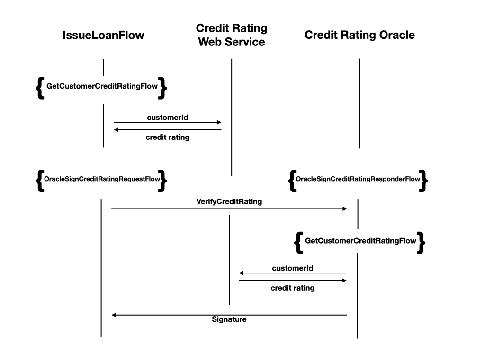
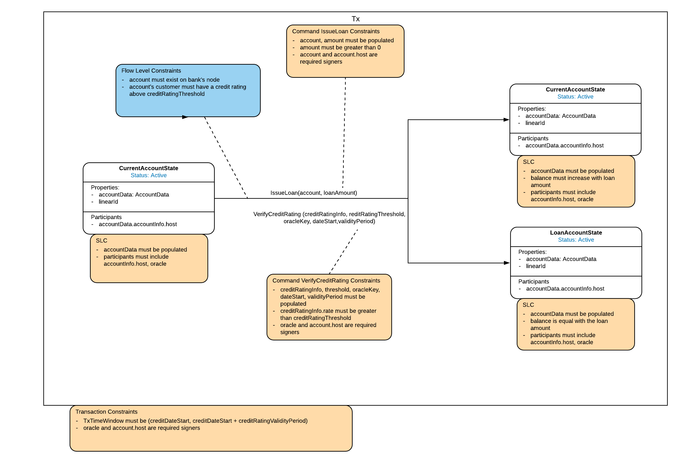
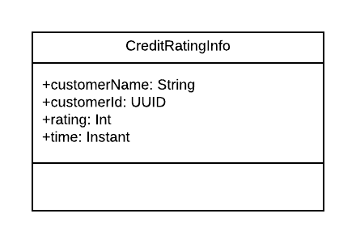

# Loans

## Introduction

### Rationale

> A penny saved is a penny lent

Loans are the fundamental way a bank makes money. Banks use depositor's funds to make loans (taking deposits and making loans), and will provide a range of financial services to attract customer deposits e.g. interest savings accounts, payment facilities, low fee current accounts etc. In simple terms, the interest collected on loan repayments minus the interest paid to savings accounts, is the banks' profit. Of course, in modern day banking, banks generate substantial profits from fees and charges, and a banks' lending can be multiples of the deposits held.

Credit risk is the possibility of a loss resulting from a borrower's failure to repay the owed principal and interest of a loan, which results in cash flow interruption and increased costs for collection. Lenders can have several safeguards in place to reduce this risk, including credit rating checks, loan insurance, security over some assets or a guarantee from a third party.

A credit rating determines the likelihood that the borrower will be able and willing to repay a loan within the terms of the loan agreement, without defaulting. A high credit rating indicates a high possibility of repaying the loan in its entirety, and will affect the borrower's chances of being approved for a loan. A credit rating may be poor if a customer has missed repayments on a regular basis or has failed to pay off a loan in the past. There are several credit rating agencies, and ratings can be calculated for short or long term risk. The rating system for individuals, rather than businesses or governments, is number based and known as credit scores. These scores typically range from 300 to 850, and reflect a customer's borrowing potential at a given point in time.

Loan issuances will usually require a repayment account for depositing the loan amount to and for transferring the loan repayments from. A monthly recurring payment is created on issuance for the duration of the agreed loan period, and the monthly payment amount is calculated from the owed principal with applied interest. Loan approval is subject to a credit rating check and this is facilitated by requesting a credit score for a customer from a credit rating agency.

This document describes the implementation of a loan account with credit rating check from an off-ledger system.

### Background

A transaction's contractual validity can depend on external data e.g. an exchange rate or a credit score, and disagreements could arise if participants validated the transaction based on their view of these data. Oracles are network services that provide commands encapsulating specific facts to be used in transactions. If required, a node can request a command asserting a fact from an Oracle, and if the Oracle considers the fact to be true, the requested command is sent back and the Oracle signs the transaction. (See Oracles: https://docs.corda.net/docs/corda-os/4.5/key-concepts-oracles.html)

An Oracle does not need to see every detail of a transaction, only the commands that require a signature from the Oracle and any other transaction details relevant to the Oracle. Transactions can be filtered using a nested Merkle tree approach to "tear off" the unrelated parts of the transaction. This promotes Corda's out-of-the-box privacy policy and parties are only allowed to see what they are required to see. (See transaction tear offs: https://docs.corda.net/docs/corda-os/4.5/key-concepts-tearoffs.html)

Spring is a popular Java application framework, and Spring Boot is an extension that provides an out-of-the-box, automatically configured, production-grade web server (See: https://spring.io/projects/spring-boot). Spring Boot servers can easily be deployed as off-ledger systems for querying external data for transactions e.g. exchange rates, or for exposing flows as web APIs.

### Requirements

 - An off-ledger system that reports the credit rating for a customer via a Web API
 - An Oracle to verify and sign the credit rating for a customer
 - A loan issuance flow to perform credit rating checks, deposit the loan amount to the repayment account and create a monthly recurring payment to repay the loan amount within a given period of time (in months)

### Non-Goals

 - Interest rate calculation is outside the scope of this project and the repayment amount will be the same as the loan amount
 - The credit rating check is implemented to show the use of off-ledger systems and ratings calculations will not be a focus of this implementation

## Design

### System Architecture

The following diagram shows an overview of how the issue loan flow, off-ledger credit rating system and credit rating Oracle interact over the course of the flow.



The issue loan flow queries the credit rating of the customer applying for the loan via the credit rating web service and a `VerifyCreditRating` command is created from the response. The `IssueLoanFlow` calls the `OracleSignCreditRatingRequestFlow`, which in turn, sends a request to the Oracle to verify the credit rating contained in the `VerifyCreditRating` command. This initiates `OracleSignCreditRatingResponderFlow` and the Oracle validates the credit rating with an additional request to the web service. Upon successful validation, the Oracle sends its signature to the issue loan flow and the transaction is validated.

### Flow Model

The following diagram shows the issue loan flow represented using the Corda Design Language (CDL):



The issue loan flow has two output states, the input current account state with the deposited loan amount and a new loan account, with the balance in debt to be repaid. The flow creates a recurring payment from the current account state to the loan account state for the duration of the loan period.

The transaction contains two commands: the `IssueLoan` command and the `VerifyCreditRating` command. The `IssueLoan` command verifies account related constraints, such as the input account is a current account, the loan amount deposited to the current account is the debit amount on the loan account, the accounts are active etc.

The `VerifyCreditRating` command verifies that there is a valid credit rating, the customer's credit rating exceeds a configured threshold and that the credit rating Oracle has signed the credit rating and considers it to be valid. The transaction additionally checks that the credit rating has not expired and the issue time is within a configured validity period.

### Data Model

Please refer to the accounts design documentation for the `LoanAccountState` data model.

The `CreditRatingInfo` data class stores the result of a credit rating request for a customer. It is returned by the off-ledger credit rating web service.



A `CreditRatingInfo` instance stores the customer's name and id, where `customerId` references a customer in the `Customer` schema (see accounts design documentation). The credit rating is stored as an int, and will typically have a value in the range 300 - 850, although different rating systems can have different ranges. The `time` property stores when the rating was generated and allows for stale checks during contract verification.

### Interface/API definitions

#### Flows

`IssueLoanFlow(accountId: UUID, loan: Amount<Currency>, periodInMonths: Int): SignedTransaction`

Issue a new loan account to the account holder of `accountId`. The loan amount (`loan`) is deposited into the current account with id `accountId`, and a recurring payment is created from the current account to the loan account for the duration of the loan term (`periodInMonths`). The monthly repayment is calculated as the loan amount divided by the loan period, interest is not considered currently.

`GetCustomerCreditRatingFlow(customerId: UUID): CreditRatingInfo`

Query the credit rating of customer with id `customerId` from the credit rating REST web server and return a `CreditRatingInfo` object.

#### Off-ledger Credit Rating Web Service API

`/creditrating/customer/{customerId}: CreditRatingInfo`

Return a `CreditRatingInfo` instance for customer with `customerId`.

#### Credit Rating Oracle

`OracleSignCreditRatingRequest(tx: TransactionBuilder, oracle: Party, partialMerkleTx: FilteredTransaction): FlowLogic<TransactionSignature>`

`OraceSignCreditRatingRequestFlowResponder(otherSession: FlowSession)`

Verifies and signs a `VerifyCreditRating` command. The request flow sends a filtered issue loan transaction and the responder flow verifies the credit rating contained within the `VerifyCreditRating` command. If the credit rating is valid, the transaction is signed and sent back to the requesting node.

### Business Logic

#### Accessing Web Services within Flows

The off-ledger credit rating web service implements a REST API and the following describes the approach to query this service within a flow.

The web service request is blocking and needs to be executed outside of the flow execution thread. Flow external operations are designed for this purpose and its `execute` method can be overridden with the desired blocking behaviour. The following is a skeleton implementation of the credit rating request class:

```kotlin
class CreditRatingRequestOperation(
    val customerId: UUID,
    private val creditRatingServiceAddr: String): FlowExternalOperation<CreditRatingInfo> {

    companion object {
        val httpClient: OkHttpClient =  OkHttpClient.Builder().build()
    }

    @Suspendable
    override fun execute(deduplicationId: String): CreditRatingInfo {
        // implement REST API client request
    }
}
```

The `CreditRatingRequestOperation` class will be executed in a thread provided by the node's flow external operation thread pool. The class is constructed with the `customerId` to query and the server address of the credit rating web service (`creditRatingServiceAddr`).

The `deduplicationId` allows for custom handling of duplicate runs and is useful for database insertions or value updates, but is not used in this case.

The REST API client can be implemented within the `execute` method as follows:

```kotlin
val clientCreditURL = "http://$creditRatingServiceAddr/creditRating/customer/${customerId}"
val objectMapper = JacksonSupport.createNonRpcMapper()

val response = httpClient.newCall(
        Request.Builder().url(clientCreditURL).get().build()
).execute()

return objectMapper.readValue(response.body()?.string(), CreditRatingInfo::class.java)
```

The REST API url is generated from the credit rating service server address and the customer id to query. The request is made using the `httpClient` and the response is deserialized into a `CreditRatingInfo` instance using the `objectMapper`.

The above request can then be called within a flow as follows:

```kotlin
@StartableByRPC
class GetCustomerCreditRatingFlow(val customerId: UUID) : FlowLogic<CreditRatingInfo>() {

    @Suspendable
    override fun call(): CreditRatingInfo {
        return await(CreditRatingRequestOperation(customerId, serviceHub))
    }
}
```

#### Implementing an Oracle

A node can request a command asserting a fact from an Oracle. The following shows an example implementation of a request flow:

```kotlin
@InitiatingFlow
class OracleSignCreditRatingRequestFlow(
    val tx: TransactionBuilder,
    val oracle: Party,
    val partialMerkleTx: FilteredTransaction) : FlowLogic<TransactionSignature>() {

    @Suspendable
    override fun call(): TransactionSignature {
        val oracleSession = initiateFlow(oracle)
        val resp = oracleSession.sendAndReceive<TransactionSignature>(partialMerkleTx)

        return resp.unwrap { sig ->
            check(oracleSession.counterparty.owningKey.isFulfilledBy(listOf(sig.by)))
            tx.toWireTransaction(serviceHub).checkSignature(sig)
            sig
        }
    }
}
```

The flow initiates a session with the Oracle and the filtered transaction containing the command to be verified is sent. The Oracle verifies the filtered transaction and returns a signature (see below). The request receives the signature and it is checked against the transaction `tx` to ensure the signature is valid for that transaction.

The Oracle implements the responder flow and the following is an example of a skeleton implementation:

```kotlin
@InitiatedBy(OracleSignCreditRatingRequestFlow::class)
class OracleSignCreditRatingRequestFlowResponder(val otherSession: FlowSession) : FlowLogic<Unit>() {
    @Suspendable
    override fun call() {
        val filteredTx = otherSession.receive<FilteredTransaction>().unwrap { it }

        // TODO: verify that the command information is visible and that it has the appropriate signer

        // TODO: verify command

        val signatureMetadata = SignatureMetadata(
            serviceHub.myInfo.platformVersion,
            Crypto.findSignatureScheme(ourIdentity.owningKey).schemeNumberID)

        val signableData = SignableData(filteredTx.id, signatureMetadata)
        val signature = serviceHub.keyManagementService.sign(signableData, ourIdentity.owningKey)

        otherSession.send(signature)
    }
}
```

The Oracle receives the filtered transaction and checks that the command to be verified is visible and that the Oracle is a requested signer (implementation not shown). The command is verified (again, implementation not shown), a signature is created and returned to the requesting flow. It is possible to send the signed transaction, however only the signature is required in this case.

#### Using Oracles in transactions

The credit rating Oracle verifies the credit rating of a customer contained within the `VerifyCreditRating` command, and signs the transaction if the rating is valid. The command is created as follows:

```kotlin
val oracle: Party = ConfigurationUtils.getConfiguredOracle(serviceHub)

val creditRatingInfo = subFlow(GetCustomerCreditRatingFlow(customerId))

val creditRatingThreshold = ConfigurationUtils.getCreditRatingThreshold(serviceHub)
val creditRatingValidityDuration = ConfigurationUtils.getCreditRatingValidityDuration(serviceHub)

val verifyCreditRatingCommand = Command(
    VerifyCreditRating(
        creditRatingInfo = creditRatingInfo,
        creditRatingThreshold = creditRatingThreshold,
        oracleKey = oracle.owningKey,
        dateStart = Instant.now(),
        validityPeriod = creditRatingValidityDuration),
    listOf(ourIdentity.owningKey, oracle.owningKey))
```

The command is added to the transaction and the transaction is filtered to tear-off transaction details unrelated to the Oracle. In this case, only details related to the `VerifyCreditRating` command are kept.

```kotlin
val mtx = partStx.buildFilteredTransaction(
    Predicate {
        it is Command<*> && it.value is VerifyCreditRating && oracle.owningKey in it.signers
    })
```

The above creates a filtered transaction containing only a `VerifyCreditRating` command where the Oracle is a signer. The Oracle can now be requested to sign the transaction.

```kotlin
val txtSignature = subFlow(OracleSignCreditRatingRequestFlow(txBuilder, oracle, mtx))
val oracleSignedTxt = partStx.withAdditionalSignature(txtSignature)

val tx =  subFlow(FinalityFlow(oracleSignedTxt, emptyList()))
```

And the contract can check that the Oracle has signed:

```kotlin
val commandCreditRating = tx.commandsOfType<Commands.VerifyCreditRating>().single()

commandCreditRating.signers.contains(commandCreditRating.value.oracleKey)
```

## Examples

Create a new customer account:

```kotlin
val supportingDocumentationPath = File("/path/to/supportDocumentation.zip")

val attachment = serviceHub.attachments.importAttachment(
        supportingDocumentationPath.inputStream(),
        ourIdentity.toString(),
        supportingDocumentationPath.name)

val attachments = listOf(Pair(attachment, "Supporting documentation"))

val customerId = subFlow(
    CreateCustomerFlow(
        customerName = "AN Other",
        contactNumber = "5551234",
        emailAddress = "another@r3.com",
        postCode = "ZIP 1234",
        attachments = attachments))
```

Create a new current account and set the status to active:

```kotlin
val signedTx = subFlow(
    CreateCurrentAccount(
        customerId = customerId,
        tokenType = Currency.getInstance("EUR"),
        withdrawalDailyLimit = 500,
        transferDailyLimit = 1000))

val account = signedTx.tx.outputsOfType<CurrentAccountState>().single()
subFlow(SetAccountStatusFlow(account.accountId, AccountStatus.ACTIVE))
```

Issue a loan for 1000 euro with `account` as the receiving/repayment account and a repayment period of 24 months:

```kotlin
val amount = Amount(100000, Currency.getInstance("EUR")) // 1000 euro
subFlow(IssueLoanFlow(accountId, amount, 24))
```
