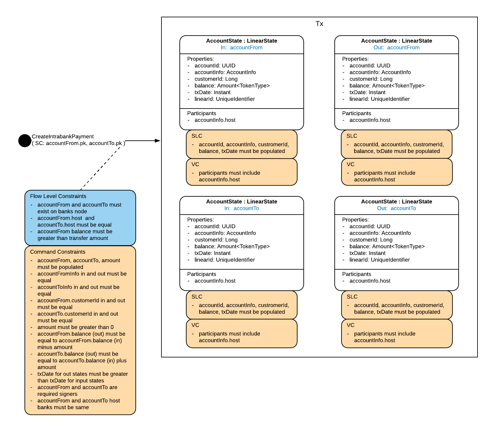
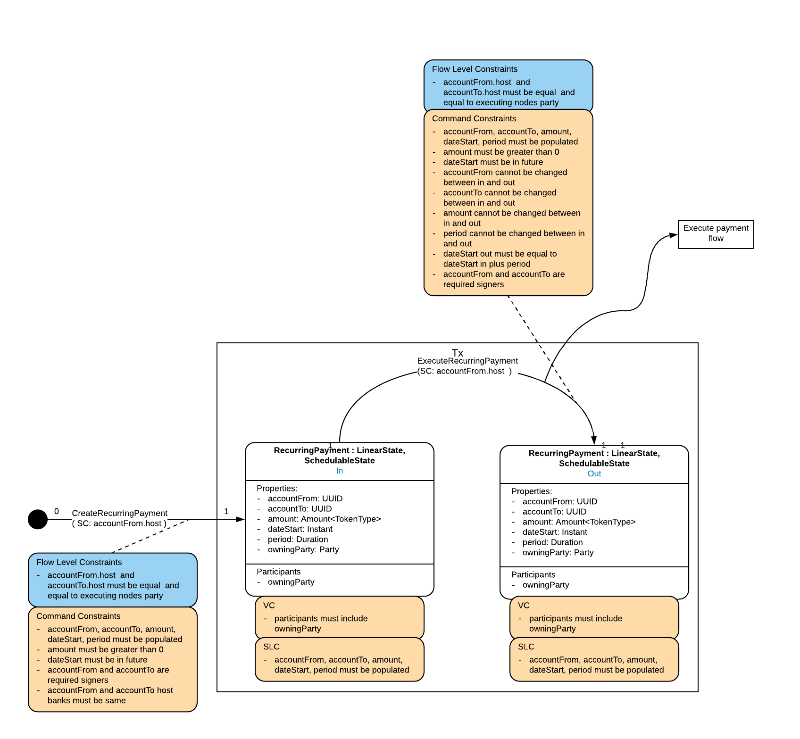
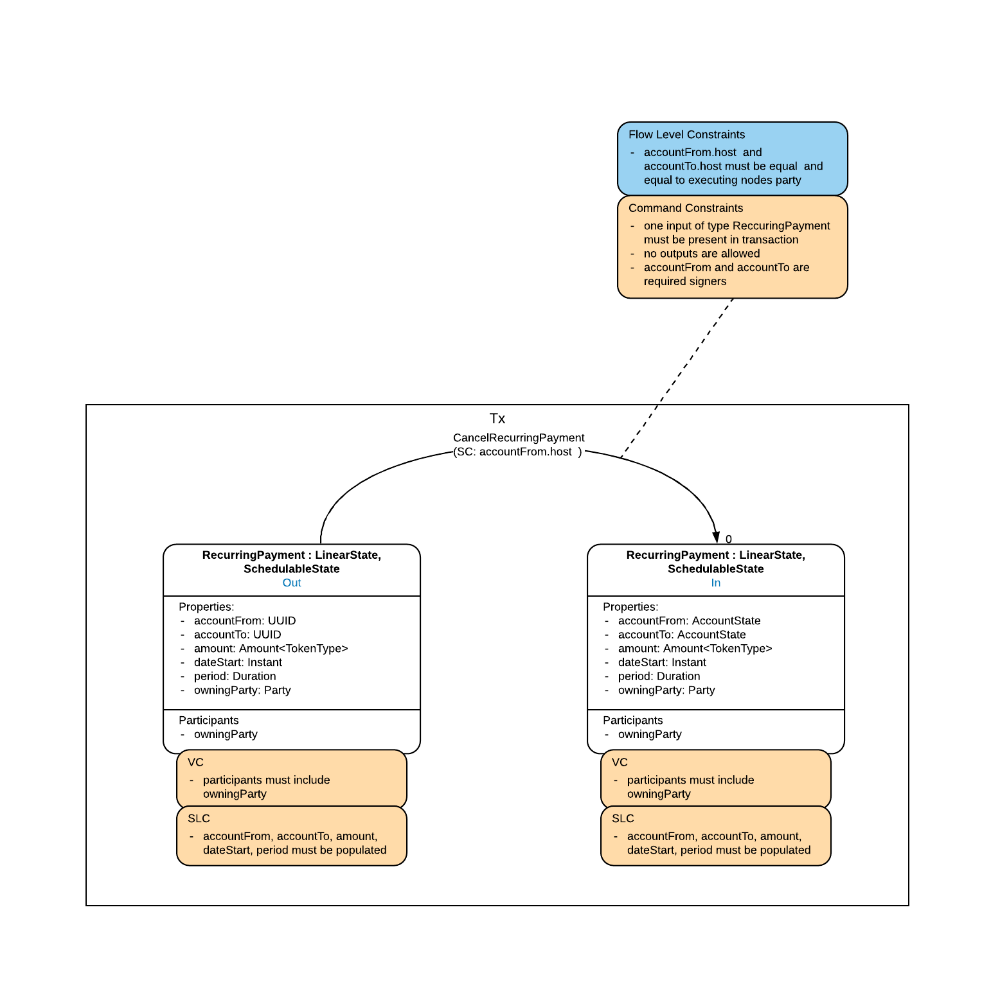
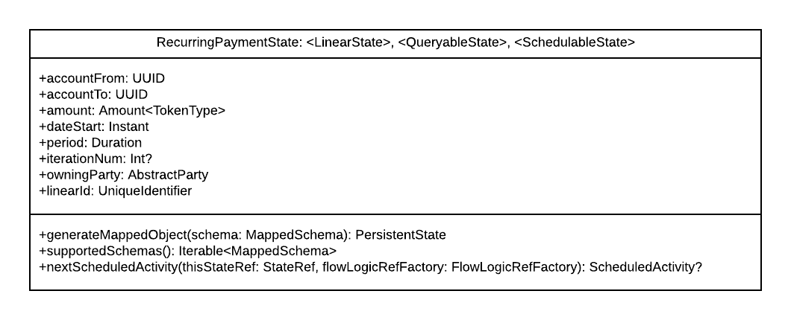
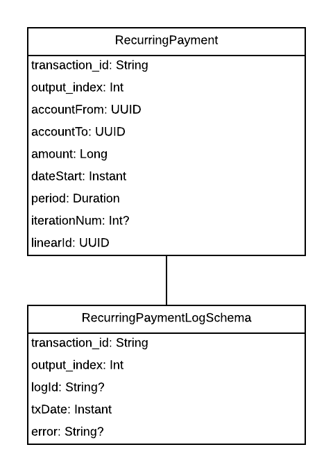

# Transfers and payments

## Introduction

### Rationale

Transfers and payments are essential banking transactions. They provide the infrastructure for many banking services, including loan repayments, monthly savings plans, bill payments and transfers between customer accounts. The transfer and payment terms are interchangeable, although we typically use the terms in different contexts e.g. transfer funds between customer accounts or make a one-off payment to a service. Both cases result in a transfer of funds from one account to another. Payments can be classified into two types:

 * One off payments.
 * Recurring payments.

A one off payment is a single transfer of funds from one account to another. This transfer type allows a customer to move funds between their accounts, make one off loan repayments, transfer savings out of a savings account at the end of a savings plan etc. Transfers are typically subject to daily limits, where the total amount transferred from an account cannot exceed a configurable daily limit.

A recurring payment is a transfer that is made periodically from a given start date, and allows for loan repayments, savings plans, bill payments etc. A recurring payment can have a set number of iterations e.g. a loan repaid over 12 months, or can execute indefinitely until manual cancellation, in the case of a bill payment. Recurring payments can be cancelled by the customer, with the exception of those that are held in agreement with the bank e.g. loan repayments and savings plans. It is possible that an executing recurring payment can fail and customers should have access to a log of failed payments for review.

The RefApp CorDapp project delivers a bank in a box, capable of facilitating core retail banking services including one-off and recurring payments. It is intended to operate as a single instance running on a single node. The implementation described here is only applicable to same bank, same node transfers and for clarity, the "intrabank transfer" term is used. Payments between banks will require additional infrastructure e.g. Corda payments, and is currently outside the scope of this app.

This document describes the implementation of an intrabank payment (or transfer) and a recurring payment.

### Background

Payments between parties that are expected to take place at some point in the future are scheduled events that occur on the current financial state. Corda models this behaviour as a next scheduled activity event that is a property of the contract state, and is implemented as a `ScedulableState`. In the recurring payment context, this state would store, or calculate, when the next payment should occur. The time sensitive event is a schedulable flow and again, in the context of the recurring payment would be the transfer transaction. (See Corda event scheduling: https://docs.corda.net/docs/corda-os/4.5/event-scheduling.html).

Some states need to be referred to by the contracts of other input or output states but not updated or consumed. Such states can be added to the transaction as reference states. Reference states differ from regular input and output states as although they are checked by the notary that they are current, they are not consumed in the transaction. Also, the contracts for the reference state are not executed for the transaction. (See reference states: https://training.corda.net/corda-details/reference-states/#using-reference-states-for-reference-data).

Flow external operations represent an external process that blocks a flow from continuing until the result of its execution has been received. This can be useful for triggering long running processes on an external system or retrieving information from a service. The `FlowExternalOperation` class is extended and the overridden `execute` method is implemented with the desired blocking behaviour. Deduplicity is handled inherently as the `execute` method receives a `deduplicationId` as a parameter, which allows for custom handling of duplicate executions. (See: https://docs.corda.net/docs/corda-os/4.5/api-flows.html#flowexternaloperation)

### Requirements

 - An intrabank payment flow to transfer funds from a credit account to another account
 - A create recurring payment flow to periodically transfer a specified amount between accounts from a set start date, with an optional number of iterations
 - A cancel recurring payment flow
 - A recurring payment log to store all failed payment attempts

## Design

### Flow Model

The following diagrams show the payment flows represented using the Corda Design Language (CDL).

#### IntrabankPaymentFlow

An intrabank payment is made by transferring funds from one account to another, or withdrawing an agreed amount from one account and simultaneously depositing it into another. The transaction takes the from account and to account as input, withdraws and deposits the agreed amount and adds the resulting states with updated balances as output. The diagram below shows the command constraints.



#### CreateRecurringPaymentFlow and ExecuteRecurringPaymentFlow

The create recurring payment flow issues a new `RecurringPaymentState` on the ledger. This state stores the transfer information (`accountFrom`, `accountTo` and `amount`) and the scheduling information (`dateStart`, `period` and `iterationNum`). The recurring payment is executed in the `ExecuteRecurringPaymentFlow` with the `dateStart` and `iterationNum` properties being updated for the next payment occurrence.



#### CancelRecurringPaymentFlow

The cancel recurring payment flow processes the cancellation by consuming the `RecurringPaymentState`. The last unconsumed `RecurringPaymentState` is added as input to the transaction, which generates no output, and the state is consumed.



### Data Model

A recurring payment is modeled as a `RecurringPaymentState`, which implements the `SchedulableState` interface. The `nextScheduledActivity` method of the interface, indicates if there is some activity that needs to be performed at some point in the future, in respect to this state. The state calculates when the next payment should occur and returns an `ExecuteRecurringPaymentFlow` scheduled activity, to be executed at the time of the next payment. The following is the `RecurringPaymentState` class diagram:



The `RecurringPaymentState` stores the transfer transaction details (`accountFrom`, `accountTo` and `amount`), along with scheduling information (`dateStart` and `period`). The optional `interationNum` property indicates the total number of payments that should be made, and allows the modeling of loan or savings plan repayments. The state implements the `QueryableState` interface, allowing the querying of active recurring payments on an account, and the `LinearState`, as the `dateStart` and `iterationNum` properties are updated on each payment.

The `RecurringPaymentState` is mapped to the `RecurringPayment` schema, where each iteration of a payment is stored, and the `RecurringPaymentLog` schema additionally stores failed payment details including the transaction time and an optional error message.



### Interface/API definitions

`IntrabankPaymentFlow(accountFrom: UUID, accountTo: UUID, amount: Amount<Currency>): SignedTransaction`

Transfer `amount` from a credit account to another account. Verifies that both accounts exist on the ledger, that `accountFrom` is a credit account and that it has sufficient funds for the transfer to take place. If the from account has a transfer limit in place, this check is also done prior to the signing of the transaction.

`CreateRecurringPaymentFlow(accountFrom: UUID, accountTo: UUID, amount: Amount<Currency>, dateStart: Instant, period: Duration, iterationNum: Int?): SignedTransaction`

Create a recurring payment for `amount` from a credit account to another account. The payments begin at `dateStart` and occur every `period` e.g. 1 month, up to an optional number of `iterationNum` payments.

`CancelRecurringPaymentFlow(recurringPaymentId: UniqueIdentifier): SignedTransaction`

Cancels a recurring payment with id `recurringPaymentId` by consuming the `RecurringPaymentState` schedulable state.

`ExecuteRecurringPaymentFlow(recurringPaymentStateRef): SignedTransaction`

Schedulable flow to execute a recurring payment occurrence. The flow is initiated by the `StateRef` of the `RecurringPaymentState` schedulable state, and is executed using the `IntrabankPaymentFlow`. The result is logged to the `RecurringPaymentLogSchema`.

### Business Logic

#### Deduplicating payment logs

In Corda, notaries prevent the double spending of contract states but this naturally excludes off ledger systems. Instead, Corda provides a `FlowExternalOperation` that is executed with a `deduplicationId`, allowing for custom handling of duplicate runs. Each recurring payment execution is logged and duplicate logs can be avoided by creating the payment log instance within a subclass of `FlowExternalOperation`.

The skeleton `CreateRecurringPaymentLogOperation` is as follows:

```kotlin
class CreateRecurringPaymentLogOperation(
    private val recurringPaymentStateAndRef: StateAndRef<RecurringPaymentState>,
    private val recurringPaymentLogRepository: RecurringPaymentLogRepository,
    private val exception: Exception? = null): FlowExternalOperation<RecurringPaymentLogSchemaV1.RecurringPaymentLog> {

}
```

Subclasses of `FlowExternalOperation` must override the `execute` method, which receives the `deduplicationId` parameter. Payment logs are stored with the `deduplicationId` (in the column `logId`) and a new payment log is only created if the `deduplicationId` does not exist in the `RecurringPaymentLog` schema.

```kotlin
override fun execute(deduplicationId: String): RecurringPaymentLogSchemaV1.RecurringPaymentLog {
    var recurringPaymentLog: RecurringPaymentLogSchemaV1.RecurringPaymentLog? = null

    try {
        recurringPaymentLog = recurringPaymentLogRepository.getRecurringPaymentLogById(deduplicationId)
    } catch (e: IllegalArgumentException) {
        contextLogger().info("Recurring payment logs not found for deduplicationId: $deduplicationId, new entry will be added.")
    }
    return recurringPaymentLog?: createRecurringPaymentLog(deduplicationId)
}
```

#### Checking if a recurring payment can be cancelled using reference states

Recurring payments created by the customer should be cancellable by the customer. This excludes loan repayments and savings plan payments, which are created and owned by the bank. Checking if a customer owns and can cancel a recurring payment could be accomplished with authentication but in the current scope, another solution is needed. The proposed solution is to add the destination account as a reference state to the cancel recurring payment transaction, and check if the account type is a `LoanAccountState` or a `SavingsAccountState`.

 - Add the destination account to the transaction as a reference state:

```kotlin
val accountTo = accountRepository.getAccountStateById(recurringPayment.state.data.accountTo)

val txBuilder = TransactionBuilder(notary)
        .addInputState(recurringPayment)
        .addCommand(command)
        .addReferenceState(ReferencedStateAndRef(accountTo))
        .setTimeWindow(TimeWindow.fromOnly(Instant.now()))
```

 - This state can now be referenced in the contract:

```kotlin
val referencedToAccount = tx.referenceInputRefsOfType<Account>().single().state.data
```

 - Check that the destination account is not a loan account:

```kotlin
requireThat {
    "Recurring payment cannot be cancelled for loan repayments" using (referencedToAccount !is LoanAccountState)
}
```

 - Or a savings account that is still part of a savings plan:

```kotlin
requireThat {
    if (referencedToAccount is SavingsAccountState) {
        "Recurring payment cannot be cancelled for saving repayments during savings period" using
                (referencedToAccount.savingsEndDate.isBefore(tx.timeWindow!!.fromTime!!))
    }
}
```

## Examples

Create a new customer account:

```kotlin
val supportingDocumentationPath = File("/path/to/supportDocumentation.zip")

val attachment = serviceHub.attachments.importAttachment(
        supportingDocumentationPath.inputStream(),
        ourIdentity.toString(),
        supportingDocumentationPath.name)

val attachments = listOf(Pair(attachment, "Supporting documentation"))

val customerId = subFlow(
    CreateCustomerFlow(
        customerName = "AN Other", 
        contactNumber = "5551234", 
        emailAddress = "another@r3.com", 
        postCode = "ZIP 1234", 
        attachments = attachments))
```

Create two new current accounts and set their status to active:

```kotlin
val signedTxFromAccount = subFlow(
    CreateCurrentAccount(
        customerId = customerId, 
        tokenType = Currency.getInstance("EUR"),
        withdrawalDailyLimit = 500,
        transferDailyLimit = 1000))

val signedTxToAccount = subFlow(
    CreateCurrentAccount(
        customerId = customerId, 
        tokenType = Currency.getInstance("EUR"),
        withdrawalDailyLimit = 500,
        transferDailyLimit = 1000))

val accountFrom = signedTxFromAccount.tx.outputsOfType<CurrentAccountState>().single()
val accountTo = signedTxToAccount.tx.outputsOfType<CurrentAccountState>().single()

subFlow(SetAccountStatusFlow(accountFrom.accountId, AccountStatus.ACTIVE))
subFlow(SetAccountStatusFlow(accountTo.accountId, AccountStatus.ACTIVE))
```

Deposit funds into the from account:

```kotlin
val amount = Amount(100000, Currency.getInstance("EUR")) // 1000 euro
subFlow(DepositFiatFlow(accountFrom, amount))
```

Execute a one off payment of 100 euro from `accountFrom` to `accountTo`:

```kotlin
val amount = Amount(10000, Currency.getInstance("EUR")) // 100 euro
subFlow(IntrabankPaymentFlow(accountFrom, accountTo, amount))
```

Create a recurring payment of 100 euro every 10 seconds, starting now, for 5 repayments:

```kotlin
val amount = Amount(10000, Currency.getInstance("EUR")) // 100 euro
subFlow(CreateRecurringPaymentFlow(accountFrom, accountTo, amount, Instant.now(), Duration.ofSeconds(10), 5))
```

Create a recurring payment of 10 euro every day, starting now, with no expiry:

```kotlin
val amount = Amount(1000, Currency.getInstance("EUR")) // 10 euro
val signedTx = subFlow(CreateRecurringPaymentFlow(accountFrom, accountTo, amount, Instant.now(), Duration.ofDays(1)))
```

Cancel the recurring payment:

```kotlin
val recurringPayment = signedTx.tx.outputsOfType<RecurringPaymentState>().single()
subFlow(CancelRecurringPayment(recurringPayment.linearId))
```
