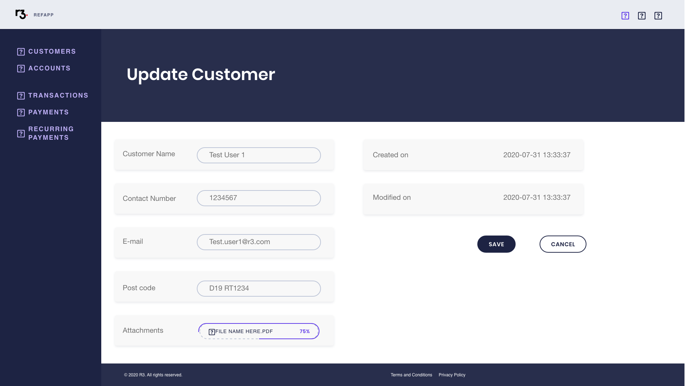

# UI

## Introduction

### Rationale

The UI is a critical part of any software product. While good UIs can often go unnoticed, a poorly designed and implemented UI limits a user's ability to effectively use a product. To increase the chances of success, most UIs are designed with the following principles in mind:

 - Place users in control of the interface.
 - Make it comfortable to interact with the product.
 - Reduce cognitive load.
 - Make user interfaces consistent.

These design principles include many fundamental concepts of user interface design, such as, making the interface easy to navigate, providing informative feedback, promoting visual clarity, and consistency in style and functionality.

Most users will have at least some familiarity with a banking app and it is important to build on this familiarity. A UX study on digital banking interfaces reveals that transparency, self-service, simplicity and aesthetic are of the most important principles in online banking app design ([UX Design Case Study: How to Create a Digital Banking Interface](https://uxplanet.org/the-way-digital-banking-should-work-1d278efa96a6)). The UI should make it easy to perform the most necessary tasks quickly and should also be attractive and easy to use.

It is important that the UI is responsive, retains functionality and offers the same style choices across device types and screen resolutions, from desktop to tablet and mobile. This greatly improves the user experience, making banking services accessible wherever the user may be, and should be standard for any banking app.

The Bank in a Box app requires delivery of two separate UI experiences, one for banking employees and one for customers. There should be a clear divide between these roles as there are many tasks that should be available only to banking employees - for example, account and loan approval or having access to other customers' accounts. Conversely, a customer should have complete control over the workings of their accounts and a banking employee should not be able to transfer funds from a customer's account.

### Background

Adobe XD is a vector-based user experience design tool for web and mobile apps (https://adobe.com/xd). The software allows rapid creation and iteration of designs, and these designs can easily be converted into complex interactive prototypes. Prototypes can be previewed on different screen sizes and mobile devices. Finalized designs can be exported and used as a valuable reference for UI development.

React is a widely used Javascript framework for building user interfaces (https://reactjs.org). It is actively maintained and used by leading companies, like Facebook, Apple, PayPal, and many thousands of other websites. The framework has many benefits including fast rendering, code stability, native mobile support, and has the backing of a strong community. It allows easy development of custom components and boosts productivity by promoting the reuse of assets.

Material-UI is an open-source project of React components that implement Google's Material Design (https://material-ui.com). It features a large library of components and provides access to a fully customizable theme. The library has extensive support, is regularly updated, and has a large community of users providing external support and examples.

### Requirements

#### Admin role
 - Home screen.
 - Assign Users and Revoke Customers.
 - Customers List screen.
 - Update and Create Customer screens.
 - Create Current Account and Create Savings Account screens.
 - Accounts screen.
 - Accounts - Account tab.
 - Accounts - Approve Overdraft.
 - Accounts - Customer tab.
 - Accounts - Issue Loan.
 - Accounts - Set Limits.
 - Accounts - Set Status.
 - Accounts - Transaction tab.
 - Accounts - Recurring Payment tab.
 - Payments - Deposit tab.
 - Payments - Withdrawal tab.
 - Recurring Payments screen.
 - Recurring Payments - Account tab.
 - Recurring Payments - Create Recurring Payment.
 - Recurring Payments - Recurring Payment tab.
 - Transactions screen.
 - Transactions - Transaction tab.
 - Transactions - Account tab.

#### Customer role
 - Home screen.
 - Accounts screen.
 - Accounts - Account tab.
 - Accounts - Customer tab.
 - Accounts - Recurring Payment tab.
 - Accounts - Set Limits.
 - Accounts - Transaction tab.
 - Update My Profile screen.
 - Payments - Intrabank Payment tab.
 - Recurring Payments screen.
 - Recurring Payments - Account tab.
 - Recurring Payments - Create Recurring Payment.
 - Recurring Payments - Recurring Payment tab.
 - Transactions screen.
 - Transactions - Account tab.
 - Transactions - Transaction tab.

## Design

### Screens

#### Admin Role

##### Home screen

Landing screen for the Admin role.

The following screens are accessible from the sidebar menu:

 - Customers.
 - Accounts.
 - Transactions.
 - Payments.
 - Recurring Payments.

##### Customers List screen

Displays a searchable table of customers.

By default, the table contains 10 users per page with the following fields:

 - Customer.
 - Contact number.
 - E-mail.

A search becomes active when the user enters at least 3 characters in the search box.

Interactive elements:
 - Clicking any of the table rows opens the update customer screen for the selected customer.
 - Clicking on the **Create new** button opens the create user screen.

##### Create Customer screen

Create a new customer screen.

Displays a screen with the following input elements:

 - Customer name.
 - Contact number.
 - E-mail.
 - Post Code.
 - Attachments (file selector).

Interactive elements:
 - Clicking on the **Save** button saves the input customer data or displays an appropriate error message for missing fields.
 - Clicking on the **Cancel** button redirects to the Customer list screen.

##### Update Customer screen

Update an existing customer screen.

Displays a screen with the following editable fields:
 - Contact number.
 - E-mail.
 - Attachments.

And the following fields should not be editable:
 - Customer name.
 - Post Code.
 - Created on.
 - Modified on.

Interactive elements:
 - Clicking on the **Save** button updates the customer data or displays an appropriate error message for missing fields.
 - Clicking on the **Cancel** button redirects to the Customer list screen.

##### Create Current Account screen

Create a current account screen.

Displays a screen with the following input elements:
 - Customer name (typeahead search feature).
 - Currency (dropdown).
 - Account Type (Dropdown: Current: default, Savings).
 - Withdrawal daily limit.
 - Transfer daily limit.

Interactive elements:
 - Selecting **Savings** in the **Account Type** dropdown opens the Create Savings Account screen.
 - Clicking on the **Save** button creates a new current account or displays an appropriate error message for missing fields.
 - Clicking on the **Cancel** button redirects to the Customer list screen.

##### Create Savings Account screen

Create a savings account screen.

Displays a screen with the following input elements:
 - Customer name (typeahead search feature).
 - Currency (dropdown).
 - Account Type (Dropdown: Current, Savings: default).
 - Current Account (typeahead search feature).
 - Savings start date.
 - Savings Period.

Interactive elements:
 - Selecting **Current** in the **Account Type** dropdown opens the Create Current Account screen.
 - Clicking on the **Save** button creates a new savings account or displays an appropriate error message for missing fields.
 - Clicking on the **Cancel** button redirects to the Customer list screen.

##### Accounts screen

Displays a searchable table of accounts.

By default, the table contains 10 accounts per page with the following fields:

 - Account Key.
 - Customer Name.
 - Type.
 - Currency.
 - Balance.
 - Last transaction date.

A search becomes active when the user enters at least 3 characters in the search box.

Interactive elements:
 - Clicking any of the table rows opens the account screen with account tab in focus with data for the selected account.
 - Clicking on the **Create new** button opens the create current account screen.

##### Accounts - Account tab

Displays the account tab of the accounts screen.

Displays account data for the selected account from the accounts screen.

The following fields should be populated:
 - Account Key.
 - Currency.
 - Balance.
 - Account Type.
 - Status.
 - Last transaction date.

The following fields should additionally be populated for current account types:
 - Withdrawal Daily Limit.
 - Transfer Daily Limit.
 - Approved Overdraft Limit.
 - Overdraft Balance.

The following interactive elements should be displayed:
 - **Approve Overdraft** should be shown only for current accounts.
 - **Issue Loan** should be shown only for current accounts.
 - **Set Limits** should be shown only for current accounts.
 - **Set Status** should be shown for all account types.

Interactive elements:
 - Clicking on the **Approve Overdraft** button opens the approve overdraft screen.
 - Clicking on the **Issue Loan** button opens the issue loan screen.
 - Clicking on the **Set Limits** button opens the set limits screen.
 - Clicking on the **Set Status** button opens the set status screen.

##### Accounts - Approve Overdraft

Approves an overdraft for the selected current account from the account tab.

The screen should display the following input elements:
 - Overdraft limit

Interactive elements:
 - Clicking the **Save** button approves an overdraft for the selected current account or displays an appropriate error message for missing fields.
 - Clicking the **Cancel** button returns to the account tab screen.

##### Accounts - Customer tab

Displays the customer tab of the account screen with customer data populated for the selected account.

The following fields should be populated with customer data for the selected account:
 - Customer Name.
 - Contact Number.
 - E-mail.
 - Post Code.
 - Attachments.
 - Created on.
 - Modified on.

##### Accounts - Issue Loan

Issues a loan with the selected current account from the account tab as the repayment account.

The screen should display the following input elements:
 - Loan Amount.
 - Period in months.

Interactive elements:
 - Clicking the **Save** button issues a loan for the selected current account or displays an appropriate error message for missing fields.
 - Clicking the **Cancel** button returns to the account tab screen.

##### Accounts - Set Limits

Set account limits for the selected current account from the account tab.

The screen should display the following input elements:
 - Withdrawal Daily Limit.
 - Transfer Daily Limit.

Interactive elements:
 - Clicking the **Save** button updates the limits for the selected current account or displays an appropriate error message for missing fields.
 - Clicking the **Cancel** button returns to the account tab screen.

##### Accounts - Set Status

Set account status for the selected account from the account tab.

The screen should display the following input elements:
 - Account Status (dropdown with values: ACTIVE: default, PENDING, SUSPENDED).

Interactive elements:
 - Clicking the **Save** button updates the status for the selected account or displays an appropriate error message for missing fields.
 - Clicking the **Cancel** button returns to the account tab screen.

##### Accounts - Transaction tab

Displays the transaction tab of the account screen with a list of transactions for the selected account.

By default, the table contains 10 transactions per page with the following fields:

 - Transaction Id.
 - Account From.
 - Account To.
 - Amount.
 - Transaction Type.
 - Transaction Date.

Interactive elements:
 - Clicking any of the table rows opens the transaction screen with the transaction tab in focus and populated with details of the selected transaction.

##### Accounts - Recurring Payment tab

Displays the recurring payment tab of the account screen with a list of recurring payments for the selected account.

By default, the table contains 10 recurring payments per page with the following fields:

 - Period.
 - Account From.
 - Account To.
 - Amount.
 - Iterations Left.
 - Next Payment Date.

Interactive elements:
 - Clicking any of the table rows opens the recurring payment screen with the recurring payment tab in focus and populated with details of the selected recurring payment.

##### Payments - Deposit tab

Displays the Deposit tab of the Payments screen.

The screen should display the following input elements:
 - Account To (search box with typeahead feature).
 - Amount.
 - Currency (dropdown).

Interactive elements:
 - Clicking the **Save** button executes the deposit transaction or displays an appropriate error message for missing fields.
 - Clicking the **Cancel** button clears the form of the user's entries.

##### Payments - Withdrawal tab

Displays the Withdrawal tab of the Payments screen.

The screen should display the following input elements:
 - Account From (search box with typeahead feature).
 - Amount.
 - Currency (dropdown).

Interactive elements:
 - Clicking the **Save** button executes the withdrawal transaction or displays an appropriate error message for missing fields.
 - Clicking the **Cancel** button clears the form of the user's entries.

##### Recurring Payments screen

Displays a searchable table of recurring payments.

By default, the table contains 10 recurring payments per page with the following fields:

 - Period.
 - Account From.
 - Account To.
 - Amount.
 - Iterations Left.
 - Next Payment Date.

A search becomes active when the user enters at least 3 characters in the search box.

Interactive elements:
 - Clicking any of the table rows opens the recurring payment screen with the recurring payment tab in focus and populated with details of the selected recurring payment.
 - Clicking on the **Create new** button opens the create current account screen.

##### Recurring Payments - Account tab

Displays account data for the selected recurring payment.

The following fields should be populated with account data for the selected recurring payment:
 - Account From (account from key).
 - Account Type (account from type).
 - Customer Name (account from's customer name).
 - Account To (account to key).
 - Account Type (account to type).
 - Customer Name (account to's customer name).

##### Recurring Payments - Recurring Payment tab

Displays data for the selected recurring payment.

The following fields should be populated with details of the selected recurring payment:
 - Recurring Payment Id.
 - Amount.
 - Currency.
 - Error.
 - Transaction Date.
 - Iterations Left.
 - Period.
 - Next Payment Date.

Interactive elements:
 - Clicking the **Cancel Recurring Payment** button cancels the selected recurring payment.

##### Transactions screen

Displays a searchable table of transactions.

By default, the table contains 10 transactions per page with the following fields:

 - Transaction Id.
 - Account From.
 - Account To.
 - Amount.
 - Transaction Type.
 - Transaction Date.

A search becomes active when the user enters at least 3 characters in the search box.

Interactive elements:
 - Clicking any of the table rows opens the transaction screen with the transaction tab in focus and populated with details of the selected transaction.

##### Transactions - Transaction tab

Displays data for the selected transaction.

The following fields should be populated with details of the selected transaction:
 - Transaction Id.
 - Amount.
 - Currency.
 - Transaction Type.
 - Transaction Date.

##### Transactions - Account tab

Displays account data for the selected transaction.

The following fields should be populated with account data for the selected recurring payment:
 - Account From (account from key).
 - Account Type (account from type).
 - Customer Name (account from's customer name).
 - Account To (account to key).
 - Account Type (account to type).
 - Customer Name (account to's customer name).

#### Customer Role

##### Home screen

Landing screen for the Customer role.

The following screens are accessible from the sidebar menu:
 - Accounts.
 - Transactions.
 - Payments.
 - Recurring Payments.

##### Accounts screen

Displays a searchable list of accounts for the authenticated customer.

By default, the table contains 10 accounts per page with the following fields:

 - Account Key.
 - Customer Name.
 - Type.
 - Currency.
 - Balance.
 - Last transaction date.

A search becomes active when the user enters at least 3 characters in the search box.

Interactive elements:
 - Clicking any of the table rows opens the account screen with account tab in focus with data for the selected account.

##### Accounts - Account tab

Displays account data for the selected account from the accounts screen.

The following fields should be populated:
 - Account Key.
 - Currency.
 - Balance.
 - Account Type.
 - Status.
 - Last transaction date.

The following fields should additionally be populated for current account types:
 - Withdrawal Daily Limit.
 - Transfer Daily Limit.
 - Approved Overdraft Limit.
 - Overdraft Balance.

The following interactive elements should be displayed:
 - **Set Limits** should be shown only for current accounts.

Interactive elements:
 - Clicking on the **Set Limits** button opens the set limits screen.

##### Accounts - Customer tab

Displays customer details for the selected account.

The following fields should be populated with customer data for the selected account:
 - Customer Name.
 - Contact Number.
 - E-mail.
 - Post Code.
 - Attachments.
 - Created on.
 - Modified on.

##### Accounts - Recurring Payment tab

Displays the recurring payment tab of the account screen with a list of recurring payments for the selected account.

By default, the table contains 10 recurring payments per page with the following fields:

 - Period.
 - Account From.
 - Account To.
 - Amount.
 - Iterations Left.
 - Next Payment Date.

Interactive elements:
 - Clicking any of the table rows opens the recurring payment screen with the recurring payment tab in focus and populated with details of the selected recurring payment.

##### Accounts - Set Limits

Set account limits for the customer's selected current account from the account tab.

The screen should display the following input elements:
 - Withdrawal Daily Limit.
 - Transfer Daily Limit.

Interactive elements:
 - Clicking the **Save** button updates the limits for the selected current account or displays an appropriate error message for missing fields.
 - Clicking the **Cancel** button returns to the account tab screen.

##### Accounts - Transaction tab

Displays the transaction tab of the account screen with a list of transactions for the selected account.

By default, the table contains 10 transactions per page with the following fields:

 - Transaction Id.
 - Account From.
 - Account To.
 - Amount.
 - Transaction Type.
 - Transaction Date.

Interactive elements:
 - Clicking any of the table rows opens the transaction screen with the transaction tab in focus and populated with details of the selected transaction.

##### Update My Profile screen

Displays the Update My Profile screen for the authenticated customer.

Displays a screen with the following editable fields:
 - Contact number.
 - E-mail.

And the following fields should not be editable:
 - Customer name.
 - Post Code.
 - Attachments.
 - Created on.
 - Modified on.

Interactive elements:
 - Clicking on the **Save** button updates the customer data or displays an appropriate error message for missing fields.
 - Clicking on the **Cancel** button redirects to the Customer Home screen.

##### Payments - Intrabank Payment tab

Displays the intrabank payments screen for the authenticated customer.

The screen should display the following input elements:
 - Account From (dropdown populated with customers' accounts).
 - Account To (editable dropdown populated with customers' accounts).
 - Amount.
 - Currency.

Interactive elements:
 - Clicking on the **Save** button creates a new intrabank payment or displays an appropriate error message for missing fields.
 - Clicking on the **Cancel** button clears the form of the customer's entries.

##### Recurring Payments screen

Displays a searchable table of recurring payments for the authenticated customer.

By default, the table contains 10 customer recurring payments per page with the following fields:

 - Period.
 - Account From.
 - Account To.
 - Amount.
 - Iterations Left.
 - Next Payment Date.

A search becomes active when the user enters at least 3 characters in the search box.

Interactive elements:
 - Clicking any of the table rows opens the recurring payment screen with the recurring payment tab in focus and populated with details of the selected recurring payment.
 - Clicking on the **Create new** button opens the create recurring payment screen.

##### Recurring Payments - Account tab

Displays account data for the selected customer recurring payment.

The following fields should be populated with account data for the selected recurring payment:
 - Account From (account from key).
 - Account Type (account from type, visible only if the customer owns the account).
 - Customer Name (account from's customer name).
 - Account To (account to key).
 - Account Type (account to type, visible only if the customer owns the account).
 - Customer Name (account to's customer name).

##### Recurring Payments - Create Recurring Payment

Displays the Create Recurring Payment screen.

The screen should display the following input elements:
 - Account From (dropdown populated with customers' accounts).
 - Account To (editable dropdown populated with customers' accounts).
 - Amount.
 - Date Start.
 - Period in months.
 - Number of iterations (optional field).

Interactive elements:
 - Clicking on the **Save** button creates a new recurring payment or displays an appropriate error message for missing fields.
 - Clicking on the **Cancel** button redirects to the Recurring Payment screen.

##### Recurring Payments - Recurring Payment tab

Displays data for the selected customer recurring payment.

The following fields should be populated with details of the selected recurring payment:
 - Recurring Payment Id.
 - Amount.
 - Currency.
 - Error.
 - Transaction Date.
 - Iterations Left.
 - Period.
 - Next Payment Date.

Interactive elements:
 - Clicking the **Cancel Recurring Payment** button cancels the selected recurring payment.

##### Transactions screen

Displays a searchable table of transactions for the authenticated customer.

By default, the table contains 10 customer transactions per page with the following fields:

 - Transaction Id.
 - Account From.
 - Account To.
 - Amount.
 - Transaction Type.
 - Transaction Date.

A search becomes active when the user enters at least 3 characters in the search box.

Interactive elements:
 - Clicking any of the table rows opens the transaction screen with the transaction tab in focus and populated with details of the selected transaction.

##### Transactions - Account tab

Displays account data for the selected customer transaction.

The following fields should be populated with account data for the selected recurring payment:
 - Account From (account from key).
 - Account Type (account from type, visible only if the customer owns the account).
 - Customer Name (account from's customer name).
 - Account To (account to key).
 - Account Type (account to type, visible only if the customer owns the account).
 - Customer Name (account to's customer name).

##### Transactions - Transaction tab

Displays data for the selected customer transaction.

The following fields should be populated with details of the selected transaction:
 - Transaction Id.
 - Amount.
 - Currency.
 - Transaction Type.
 - Transaction Date.
